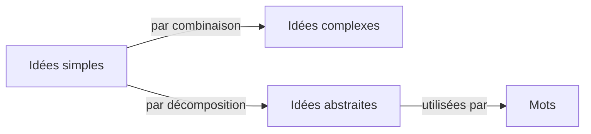

---
tags:
  - sorbonne
  - philosophie
  - histoire-philosophie-moderne
semestre: 1
---
_Essai sur l'entendement humain_, Locke
|> fonde l'empirisme
|> est très important

Leibniz a fait un commentaire linéaire sur ce livre
|> sous forme d'un dialogue
|> _Les nouveaux essais sur l'entendement humain_
-> confronte empirisme radical et rationaliste cartésien

Ici on s'intéresse au Livre II, Chapitre 1
|> construction des idées complexes dans l'esprit

Idée innée n'a pas besoin d'être pensée
|> Descartes affirme que l'idée de l'infini est innée
-> pour Locke, il n'y a pas d'idée innée

Commencement de l'âme est le début des capacités

Les bébés voient, entendent et commencent à avoir une vie consciente avant de naître
|> commencement de l'âme semble donc être avant la naissance

> [!info] Vocabulaire
> Sensations externes = sensation chez Locke
> Sensations internes = réflexion chez Locke

Ces deux sources de représentation nous donnent des idées simples
|> émotion instantanée, forme d'un visage, couleur d'un objet -> idées ne formant pas quelque chose de complexe
|> les idées simples montrent la stricte réalité, est notre accès au réel
|> les idées complexes sont des combinaisons d'idées simples
|> les idées abstraites sont une décomposition des idées simples : on arrache quelque chose qui ne devrait pas l'être -> les mots font des références à des idées abstraites
-> atomisme des sensations

Mais besoin de distinguer les qualités premières et les qualités secondes dans les idées simples
|> qualités premières = ce qui appartient objectivement aux choses (forme, taille, figure, solidité)
|> qualités secondes = ce qui provient de la manière dont les choses nous apparaissent (relation avec les sens) -> partiellement subjective (la couleur dépend mais reste la même)

> [!warning] Idées simples internes
> Les idées simples internes sont très complexes à se représenter
> |> est un pb dans la philosophie de Locke

> [!failure] Justification des idées simples et du lien avec le réel chez Locke
> Locke ne montre jamais que les idées simples montrent le réel, il s'agit d'un postulat

