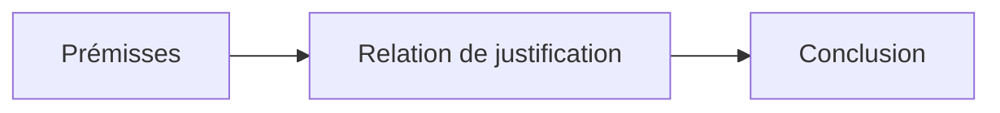
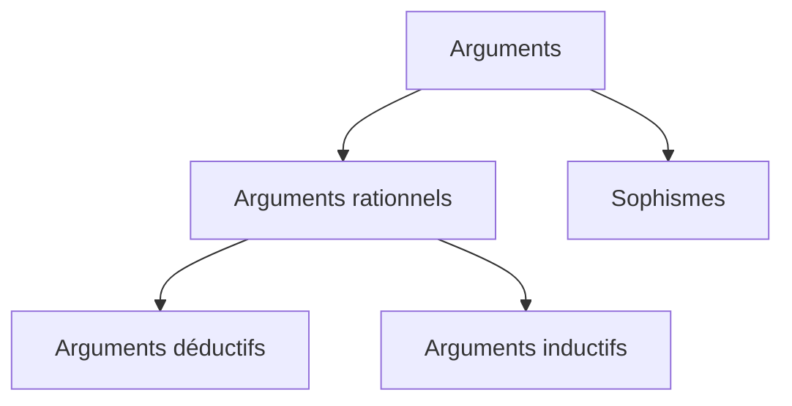

---
tags:
  - sorbonne
  - philosophie
  - pensée-critique
semestre: 1
---
Cours porte sur l'argumentation, le débat et la discussion

50% TD, 50% CM
|> Au moins 2 notes en TD
|> CM = 4 heures, une série d'exercice (même style qu'en TD)
## A. Caractérisons notre sujet d'étude
On dit pensée critique ou logique informelle

Porte sur les débats
|> on s'intéresse pas aux ordres, aux questions ou aux insultes
|> intérêt : les échanges argumentatifs

Raisonnement / discours
|> raisonnement = succession d'états mentaux intérieurs
|> discours = extériorisation du raisonnement

Essence de l'argument est la thèse exprimant une opinion, une croyance
|> mais n'est pas qu'un échange d'opinion
|> on apporte quelque chose de plus pour justifier son opinion

Conclusion doit être défendu à l'aide des prémices

Exemple :
>65% ne veulent pas acheter de voiture électrique *et* 42% pensent que c'est une mauvaise solution
>donc ce n'est pas souhaitable de favoriser leur développement

-> les prémices montrent que la voiture électrique n'est pas populaire
|> est un appel à la popularité (argument ad populum)
|> ce type d'argument est très critiqué en philosophie (dès l'Antiquité)
|> voir la mort de Socrate par Platon

>La France représente environ 1% des émissions mondiales de CO2, il est donc impertinent de baisser nos émissions de CO2

-> argument ne marche pas s'ils existent 100 pays qui émettent 1% des émissions totales...

Pensée critique = apprendre à raisonner de manière rationnelle
|> est toujours quelque chose qui a été délibérée (suppose un effort)
|> une des seules disciplines obligatoires dans tous les cursus aux US
|> s'apprend, n'est pas innée

Une inférence = un raisonnement

Jugement est une opinion à laquelle on adhère à un moment
|> on apprend à se former nos propres jugements
|> est une sorte de méthode

Ici critique est dans le sens critère : qu'est-ce qu'un bon argument

Pensée critique peut aussi bien construire (défense d'argument) que détruire (contre argument)
|> besoin d'accepter le débat
|> i.e. être ouvert aux objections, accepter d'argumenter...
### L'étude des arguments
Argument = discours (écrit ou verbal) dans lequel une thèse est défendue (est appelée conclusion)
|> argument doit défendre ou justifier cette thèse (ou hypothèse)
|> argument possède des prémisses

Une proposition a une valeur de vérité, est exprimé par des assertions
|> on se met d'accord sur ce qui est vrai
e.g. nos opinions expriment des propositions

Naissance de la pensée critique avec Platon
|> ils ont affirmé que le plus important est la vérité

Pourquoi faut-il avoir des opinions vraies ?
|> est-ce vraiment utile de chercher la vérité

Les croyances vraies permettent de réaliser nos objectifs, nos désirs
## B. Les pièges de la rhétorique
Persuader n'est pas convaincre
|> quand on persuade, on influence les croyances d'autrui sans s'intéresser à la vérité
|> quand on convainc, on vise la vérité
-> deux méthodes de manipulation même si convaincre est plus rationnel

Rhétorique = discipline étudiant l'influence par le langage
|> n'est pas que du langage (intimidation)

==_Gorgias_ et _Protagoras_ de Platon sont des textes important==

Appel aux émotions est moins rationnel que l'appel à la raison
|> les émotions nous influencent sans que l'on en ait forcément conscience

=> Rhétorique inclut la pensée critique

La pensée critique laisse le contrôle de la discussion, pas la rhétorique

_Protagoras_, Platon
>Les sophistes sont des marchands dont l'âme se nourrit

La rhétorique est indifférente de l'objectif

Sophistes faisaient payer les cours et défendaient toutes les causes indéfendables
|> « L'éloge d'Hélène », _Gorgias_, Platon

Caractère agonistique = ce qui fait référence à la lutte y compris violente

Rhétorique est vraiment agonistique

Philosophe cherche vraiment la coopération : un débat ne doit pas avoir l'objectif d'éliminer l'adversaire
|> quand on accepte le débat, on accepte d'écouter les autres

Les questions autour du débat sont très importantes car nous sommes dans l'époque de la post-vérité
|> l'époque de la post-vérité est un ensemble de discours déconnecté de la réalité
|> est la position des sophistes

_Bullshit_ d'Henry Frankfurt parle de la post-vérité
## C. Valeur de la pensée critique
Avons-nous le devoir d'être rationnel ?
|> un cours de pensée critique semble être obligé de répondre oui
|> mais est-ce vraiment le cas ?

Connaissance = 
- besoin d'avoir une opinion (on ne peut pas avoir une connaissance sur un sujet qu'on ne connait pas)
- vraie (ne peut pas être erronée)
- raison, justification (pourquoi est-ce vraie)

Quand on accorde de la valeur à la pensée critique, on en accorde aussi aux opinions et à la vérité

Une bonne opinion doit être une opinion vraie et justifiée
|> est normatif

Mais ces règles sont-elles valables ?
|> _L'Éthique de la croyance_ de William Clifford affirme que l'on a un devoir moral de rechercher la vérité (évidentialisme) -> devoir premier, absolu, inconditionné, fondamental
|> Michel Foucault affirme dans _Les leçons sur la vérité de savoir_ que la vérité est une norme de domination : on peut mettre au jour l'histoire d'une volonté de pouvoir sous la vérité

_La Vérité de savoir_, Michel Foucault
>On aura alors remplacer le jeu de la vérité dans le réseau des contraintes et des dominations. La vérité aura ainsi révéler son véritable visage qu'est celui de la domination.

Délusion = croyance totalement fausse

La recherche de la vérité peut être considéré comme un instrument
|> peut être recherché indépendamment de la recherche de la domination
|> les croyances vraies sont des instruments efficaces pour agir
-> elles ne sont pas toujours bonnes, mais elles sont utiles
|> il est pertinent de rechercher des croyances vraies car elles pourront me servir d'atteindre mes objectifs

Si notre but est de traverser la rue, alors mieux vaut avoir des croyances vraies que des délusions pour traverser

Confabulation n'est peut-être pas un mal
|> les dépressifs ont souvent de meilleurs croyances sur soi que les autres

Par contre, dans le domaine de la politique, il est extrêmement important d'avoir des croyances vraies car on possède des *objectifs*
## D. Critique des idéologiques
Nietzsche souligne que les croyances peuvent être utile
|> elles peuvent nous aider à bien vivre
|> il y a des raisons purement pratique de former des croyances

Tout n'est pas vérité et connaissance -> vérité n'est forcément la valeur la plus importante

Pascal a aussi souligné ce point (dans _Pensées_)
|> argument du paris -> on peut avoir des raisons purement pragmatique
|> former la croyance "boire de l'alcool augmente la probabilité d'avoir la maladie d’Alzheimer" est utile si on a peur de perdre la mémoire
|> un philosophe athée dans la France du XVIIe siècle sera plus heureux s'il devient catholique

Une idéologie est un ensemble de règles ne provenant pas de la vérité
|> souvent on adhère à une idéologie pour des fonctions sociales
## Signalement
Nos croyances, nos vêtements envoient des signaux informant quels groupes nous appartenant
|> valeur de vérité d'une croyance religieuse/politique sert surtout de signalement
|> explique aussi les platistes
-> argumenter sur des croyances farfelues ne sert pas à grand chose car elles servent surtout au signalement plus qu'à la raison

Critiquer qlq'un sur ses croyances peut être dangereux -> cette croyance peut faire partie de l'identité de la personne

« The ethics of belief », William K. Clifford
|> armateur pourrait croire que son bateau risque de faire naufrage mais forme une croyance irrationnelle affirmant le contraire
|> bateau fait naufrage et les migrants meurent
-> l'armateur est-il moralement condamnable ?
|> il peut être condamné moralement puisqu'il y a eu une conséquence désastreuse
|> mais toutes les croyances ont toujours des effets pratiques (hypothèse pragmatiste)
|> sauf que toutes les croyances n'ont pas les mêmes effets (est-on prêt à agir en fonction de cette croyance ?)
-> il existe des domaines où les croyances doivent être justifiées
## E. Argument, contre-argument
Un contre-argument est une objection
2 grandes manières de le faire
|> susciter le doute vis-à-vis de la conclusion (ce n'est pas contredire)
|> contredire la conclusion : montrer qu'elle est fausse

Attitude qu'on a face à un argument :
- adhérer à la proposition, la croire
- rejeter la proposition, croire sa négation
- suspendre son jugement

Susciter le doute -> critiquer une prémisse, sa logique ou sa structure
|> permet de suspendre le jugement
|> démontrer ce qu'on critique et conclure

Contredire la conclusion -> réfuter la conclusion en prouvant qu'elle est fausse
Contradiction en logique :
$$ A \rightarrow\lnot B\quad\land\quad\lnot A\rightarrow B $$
|> besoin de mettre argument sous forme standard (afficher explicitement les prémisses et la conclusion)
|> montrer que la conclusion est fausse (ou que sa négation est vraie)
## F. Objet du débat et charge de la preuve
Objet du débat = conclusion (ou l'hypothèse, ou la thèse) doit être le plus clairement identifiée
|> si ne l'est pas, on risque le faux débat (on ne parle pas de la même chose)
|-> besoin d'utiliser une terminologie claire

Charge de la preuve = qui a la responsabilité de fournir un bon argument pour prouver une thèse
|> incombe à celui qui affirme la thèse de départ
|> est proportionnel au côté étonnement de la thèse face au consensus

Quand on inverse la charge de la preuve, ça peut être grave (notamment dans un contexte juridique)
|> le complotisme inverse souvent la charge de la preuve
-> est un sophisme (appel à l'ignorance, *argumentum ad ignorantiam*)
|> en inversant, on doit croire toutes les hypothèses jusqu'à ce qu'elle soit fausse, ce qui serait déraisonnable

Argumenter en faveur du consensus est moins utile qu'argumenter contre
|> le consensus est généralement admis tandis que les arguments contre ne le sont pas
## G. Classification des arguments
Trois grandes classes (classées du plus fiable au pire) :
- Arguments déductifs
- Arguments inductifs
- Sophismes

Le lien le plus fort est un lien de nécessité
|> si on part de qlq chose de vrai, alors on arrive sur qlq chose de vrai
-> arguments déductifs
|> on n'utilise que ça en mathématiques

Un lien le plus probable est un lien nécessaire avec un degré de probabilité (entre 50% et 100%)
|> n'est pas le meilleur, mais il est considéré comme fiable
-> arguments inductifs

Les sophismes (ou arguments fallacieux) sont les autres

> [!warning] Conclusion valide et vérité
> Une conclusion valide peut être fausse si les prémisses sont fausses !
> Validité $\neq$ vérité
