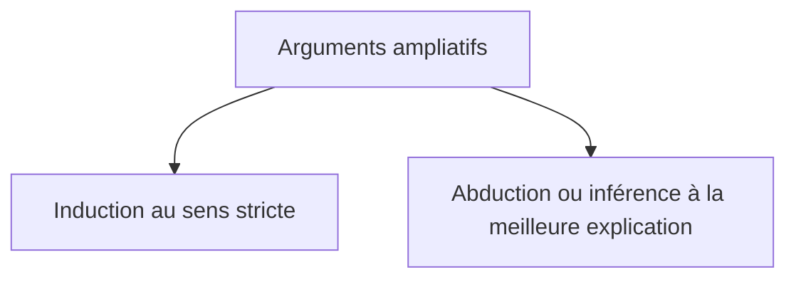

---
tags:
  - sorbonne
  - philosophie
  - pensée-critique
semestre: 1
---
### Arguments ampliatifs
Conclusion va au-delà de l'information contenue dans les prémisses
-> tous les arguments inductifs sont ampliatifs

Induction au sens stricte = raisonnement se reposant sur des statistiques ou des probabilités
|> n'est pas *forcément* une généralisation

Généralisation = argument donc la conclusion est générale
|> la réfuter est très simple (trouver un contre exemple)
|> l'établir est bcp plus compliquée

> [!info] Proposition et loi logique
> Une proposition ne doit pas avoir d'exception
> Une loi logique peut en avoir

Abduction ou inférence à la meilleure explication = ne fait pas explicitement intervenir des statistiques ou des probabilités
|> arriver à l'hypothèse qui est la meilleure explication avec une description

Pour critiquer un argument abductif, on peut :
- critiquer les prémisses
- trouver une meilleure explication

> [!important] Meilleure théorie
> Une théorie est meilleure si :
> - elle est plus simple (possède moins d'hypothèse)
> - elle explique mieux le phénomène
## Abduction et facteurs de confusion
Souvent, de nombreuses abductions ne sont pas convaincantes
|> on oublie de prendre en compte les autres abductions

> [!example] Université sexiste
> Université imaginaire reçoit autant de candidatures d'hommes et de femmes qui soient (globalement) de mêmes qualités
> |> choisit 70% des hommes et 30% des femmes
> 
> Hypothèse explicative = le jugement des examinateurs est biaisé en faveur des hommes
> |> ne marche pas car il est possible que les hommes et les femmes ne demandent pas les mêmes formations
> |> l'université peut même préférer prendre des femmes, sauf qu'elles demandent des formations plus exigeantes que les hommes, ce qui ne se traduit pas globalement
> ![[Pasted image 20241118094327.png]]
> 
> Facteur de confusion = la sélection ne dépend pas que de la personne, elle dépend aussi de la formation

> [!important] Bonne pratique
> Besoin de se méfier des inférences à la meilleure explication trop rapide
> |> souvent, elles identifient mal les causes
> -> ne permettent pas de résoudre le problème s'il existe réellement

⚠ corrélation $\neq$ causalité
|> corrélation = lien mathématiques entre deux variables
|> causalité = mécanisme causal entre les deux variables
-> quand on passe d'une corrélation à une causalité, on effectue une abduction
|> toutes les corrélations ne sont pas des causalités
## Problème philosophique de l'induction
Problème de Hume = thèse n’est justifiée que si elle suit déductivement des prémisses
|> conclusions inductives ne suivent pas déductivement des prémisses
|> donc elles ne sont pas rationnellement justifiées
-> ne marche pas car le modèle mathématique n'est pas le seul valable

Un argument est inductivement fort si la vérité de ses prémisses rendent *probable* la vérité de la conclusion

Argument inductivement sain ou correct = argument inductivement fort dont toutes les prémisses sont vraies
|> ⚠ sa conclusion peut être fausse

=> le principe de non-contradiction n'est pas forcément respecté avec