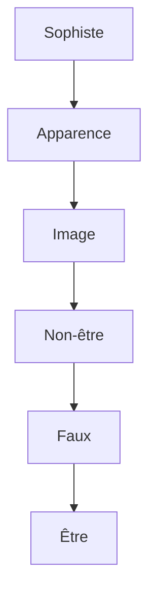

---
tags:
  - sorbonne
  - philosophie
  - histoire-philosophie-antique
semestre: 2
---
DS 10/03 et 05/05

Étude de _Le Sophiste_, Platon
|> traduction de N. Cordero (GF) ou de L. Monge (Livre de Poche)
|> est une sorte de deuxième apologie de Platon

Sophiste est un simulacre du philosophe, c'est une image
|> une image peut aussi être une copie

*Pedimental structure*

Le philosophe est l'être

La plan de l'œuvre suit cette vision : on va du sophiste à l'être pour revenir au sophiste

Cinq personnages :
- "L'Étranger" (vient d'Élée) parle avec Théétète
- Théodore présente L'Étranger à Socrate
- (aussi présence de Socrate le Jeune)

> [!important] Socrate se tait dans _Le Sophiste_
> N'est pas du tout habituel pour du Platon
> -> sort des dialogues socratiques

L'Étranger serait Platon
|> à Élée, la différence entre sophiste et philosophe est acquise
## Prologue
Parménide est le maître de Zénon, ce sont des éléates (qui viennent d'Élée)
|> ce sont des monistes (être est un, immobile, éternel, identique, ressemble à une sphère)
|> Mélissos est un(e) éléate, mais pense que l'être est infini

_Poème_ de Diels-Kranz contient les textes importants des pré-socratiques
|> contient témoignages (notés A) et fragments (notés B)

L'Étranger est aussi un éléate, mais est *heteron* (différent)
|> possède les mêmes concepts mais est différent
|> est pensé comme un dieu de la réfutation (theos elegktikos) par Socrate
|> attribue ce côté divin au côté philosophe
-> ressemble au sophiste, à un noble sophiste (Socrate)
|> mais présente pourtant comme un philosophe (Théodore)
|> compliquer de définir le genre de L'Étranger (Socrate)

Trois types de philosophe (Socrate)
1. le politique (_La République_, Platon) -> le philosophe roi
2. le sophiste (cette œuvre) -> le philosophe prétendant être sage
3. le fou  (_Théétète_ 174a, _Gorgias_ 494d1, _Phèdre_ 249c-d Platon) -> délire érotique (représenté par Thalès), déplacé/extravagant/étrange (*atopos*)

Hubris = démesure

C'est parce que la foule ignore qu'il y a trois types de philosophe -> ils switchent entre ces trois versions en fonction de ce que la foule veut
|> ces images ne sont pas identiques (elles dépendent de ce qu'est la foule)
|> politique = ceux qui se trompent sur la valeur des valeurs
|> sophisme = ceux qui se font abuser
|> fou = ceux qui comprennent la vérité
-> est troublant car pourtant la nature du philosophe est unique (Socrate)
|> provient de l'ignorance
|> opinion <=> jugement de valeurs
|> la foule ne connait que le nom (apparaît), pas la chose (est)

Quand Socrate parle, il parle à propos de la chose et non de l'image
|> c'est pour ça qu'il ne parle pas dans ce dialogue

L'Étranger parle surtout de la chose
|> n'est donc pas un sophiste
|> explique que chez lui il y a ces trois formes mais qui sont très compliqués à définir
|> ne choisit pas de faire une macrologie (discours long), mais préfère une brachylogie (discours type Socrate)
|> on a besoin d'avoir un interlocuteur : c'est Théétète jeune
-> l'Étranger obéit à Socrate, ne choisit pas forcément comme ça se passe

Platon, _République_, II, 380d
|> est une critique d'Homère
|> les dieux peuvent se transformer mais garde le même nom -> ne peut pas changer de valeur, il reste uni