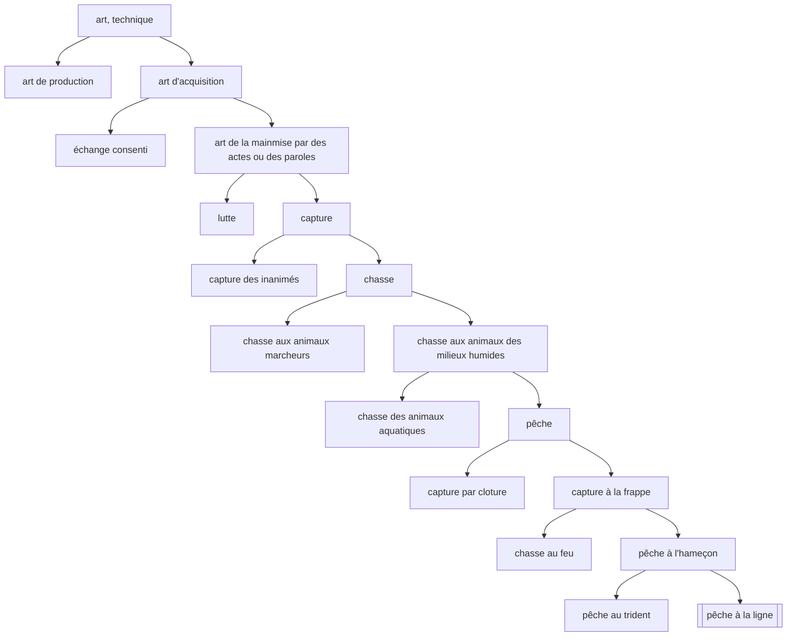

---
tags:
  - sorbonne
  - philosophie
  - histoire-philosophie-antique
  - td
semestre: 2
---
## Texte 1 - 218b6 à d5
#### Introduction
On avance étape par étape
|> on donne la situation du passage (contexte historique et dans l'œuvre)
|> pour parler du problème (difficulté du texte, la tension)
|> pour ensuite évoquer la thèse (solution du problème)
|> finalement, on évoque le plan du texte
-> tout ça est au service de l'auteur

Plan du texte :
1. « Mais c’est en commun » (l. 1) à « en le définissant » (l. 4) -> définition du sophiste sert de point de départ à la recherche commune
2. « Car pour l’heure » (l. 4) à « nom tout seul » (l. 9) -> passer d'une représentation privée à une recherche commune
3. « Quant au genre » (l. 9) à la fin -> besoin de s'exercer à sa méthode sur un paradigme plus simple

Thèse = besoin de définir le sophiste en examinant en commun sa fonction et s'exercer sur un exemple plus simple pour mieux maîtriser la bonne méthode

Problème = comment entreprendre l'entreprise de la définition ?
#### Développement
On se questionne sur l'essence
|> est la question socratique

Aristote, _Métaphysique_, $\mu$, 4, 1078b
|> existe autre chose que le sensible
|> Socrate est le premier à chercher à le définir universellement

Platon, _Cratyle_, 422b - 425b
|> imiter avec la voie, c'est faire voir la chose
|> nom permet de voir l'essence des choses
|> mot est image
(parle aussi de l'art)
|> mais la langue est imparfaite, donc on peut avoir représentation privée du mot = notre pov sur la définition du mot

Il n'y a pas de correspondance entre le mot et la chose
|> la langue est mal instituée -> elle peut parler de plusieurs choses (cf _Cratyle_)
|> justifie la possibilité de contourner le mot -> représentation privée du mot (cf _Cratyle_)
|> besoin d'avoir un accord sur le mot (sa définition) au travers du dialogue
|> *logos* (définition) est une conséquence du dialogue
-> permet de dépasser le propre pour aller au commun 

_Lois_, X, 895d
|> 3 éléments : réalité, définition et nom
|> quand on parle de la réalité, soit on s'interroge sur la définition, soit sur le nom

_Lettre_, VII, 342a-d
|> connaissance d'une chose suppose toujours la connaissance de sa définition, du nom et de sa réalité

Toute pratique est le résultat d'une action
|> l'activité de la chose est ce qu'on cherche à définir
|> besoin de s'accorder sur ce dialogue
|> chose trouve sa réalité dans l'instrument auquel elle est liée
-> besoin de respecter l'action nommée quand on définit le nom et son être
|> nom sert une fonction, un acte propre (fonction diacritique)
|> nom sert aussi une didactique
-> forme du nom rejoint sa fonction (_Cratyle_)

Étranger voit la difficulté intrinsèque de la définition du sophiste
|> Socrate aurait fait la même chose (« les belles choses sont difficiles »)
-> besoin de faire quelque chose de plus simple, sans complexité
|> paradigme sert l'entrainement car évite la complexité
|> paradigme vise la cible mais est plus simple (cible est la définition du sophiste)

> [!warning] Paradigme dans les traductions
> Possède un sens bien différent !
> |> chose permettant de faire voir
> |> est aussi bien un exemple qu'un modèle
## Après le texte
Pourquoi parler du pêcheur à la ligne pour s'exercer ?
|> est un chasseur, comme le sophiste
|> compte sur la stupidité de la proie, comme le sophiste
|> activité neutre axiologiquement (226b)
-> ressemble au sophiste, mais est beaucoup moins prétentieuse

Platon, _Timée_, 92b
|> quatrième espèce (poisson) est celle qui est tombée au plus bas de l'ignorance
|> poisson croit que la surface de la mer est un ciel (_Phèdre_, 109d)
-> plus généralement, parle de la réincarnation de l'âme

> [!info] Méthode en grec antique
> est le chemin à suivre, mais avec des choses bloquant la route (les problèmes)

Méthode de la définition : division dichotomique
|> quel genre ?
|> quelle différence ?
|> quel nom ?
|> où est la cible ?

Application de la méthode à la pêche à la ligne

> [!note] Critique par Aristote
> _Parties des animaux_, I, 2-4 et _Premiers analytiques_, I, 31
> 
> Absence de classification : répétition, addition de différences, conjonctions, division est faite par accident
> |> pas de vision organique
> 
> Non heuristique = présuppose la nature de ce qui est divisé
> 
> Non démonstratif = ne démontre absolument rien
> 
> Contre critique = ne sont pas les objectifs de Platon

Maintenant, on peut appliquer la méthode au sophiste
|> donne les six premières définitions du sophiste
|> ces définitions donnent chacune un aspect du sophiste
-> il manque systématiquement le point focal liant toutes ses définitions

La dichotomie entre offrir des présents et chercher un salaire dans la première définition du sophisme montre que le philosophe n'est pas désintéressé
|> Socrate se cache dans "offrir des présents" (_Le Banquet_)

---

**Correction du DS**
De 0 à 16, moyenne à 9.034
|> -1 point si trop de fautes d'orthographe / de grammaire

Il n'y a pas de notion de tout (comme le présuppose la notion de monde) chez Platon
|> arrive bien plus tard, chez Plotin notamment

Ce qui est une image ne pas être, car cherche à être autre chose -> aurait besoin d'un être du non-être
|> Platon pense le non-être comme notion relative : est l'autre
|> notion de Parménide est uniquement utilisée par les sophistes car leur permet d'être ce qu'ils veulent

> [!danger] Les trois types de philosophe
> Sont les types de personnes perçues *comme* philosophe par la foule
> |> ne sont pas les vrais philosophes

Opinion => jugement de valeur

---

Vision rapide des définitions du sophistes
1. chasse les riches pour avoir de l'argent (pas d'échange ici)
2. négociant nomade en science vendant des discours relatifs à l''âme -> la connaissance devient extrinsèque, car provoqué par l'argent (224d)
3. négociant (de la définition de la 2) établi dans une cité
4. idem que 3, sauf qu'il fabrique ses propres connaissances
5. éristique mercenaire -> première définition du sophiste et non plus de la sophistique
   |> sophiste devient celui luttant (cf Nietzsche, « La Joute chez Homère »)
   |> Socrate est proche de la définition, car il parle à peu de personnes et ne cherche pas être payé (voir _Gorgias_, 485d-e)
6. celui pratiquant la purification de l'âme, s'oppose au noble sophiste (i.e. philosophe, 231b) -> très troublant
   |> sophiste apparaît plus noble que celui qu'il imite
   |> sépare le meilleur du pire : est la purification, la katharme (lié à Apollon, dieu des purifications, cf _Cratyle_, 405a-c)
   |> s'occupe 

Éristique = art grâce auquel les sophistes se vantaient de pouvoir triompher de n'importe quel adversaire (cf Protagoras, _Art de l'éristique_ et Platon, _Euthydème_)

Le sophiste apparaît dans les définitions 1, 5 et 6 (mais pas dans 2, 3 et 4 car trop lié à la négociation et à l'intérêt)

> [!info] Sophisme brouillant les pistes
> 225d "4e fois" parle de la 5e définition
> 231d "4e fois" parle de la 4e définition
> -> sophiste brouille tout, y compris les philosophes

|                    | corps   |                                                                                                       | âme       |                              |
| ------------------ | ------- | ----------------------------------------------------------------------------------------------------- | --------- | ---------------------------- |
| **genres de maux** | laideur | maladie (cf _Timée_, 81e - 82a)  insurrection, guerre civile (n'est pas la guerre extérieur) | ignorance | méchanceté  perversion |
-> voir papier plutôt

Méchanceté découle de l'ignorance pour Platon
|> comme la maladie, est une rupture de l'ordre (pas de gouvernance, le commandé commande)
-> analogie au sens le plus fort possible
|> Platon est optimiste en expliquant que nul n'est méchant volontairement

---

Gorgias dans son _Traité du non-être_ critique le principe du non-être
|> Mélissos, Xénophane, Gorgias -> pseudo-aristotélicien
|> Gorgias contredit Parménide pour montrer son allégeance, pousse sa théorie le plus loin et montre que c'est impossible
-> théorie de Parménide est utilisé uniquement par les sophistes

Pour Platon, la vieillesse est source de déséquilibre psychique (cf _Lois_, XI et _Timée_)

---

L'aspiration de l'âme est la vérité
|> souhaite récupérer son mouvement
|> si l'âme erre, alors il y a une déraison (déviance mentale) -> représente quelqu'un ne cherchant pas la vérité
|> _Phédon_, 65a-c explique qu'on perd la vérité si on la cherche à l'aide de nos sens, du corps
-> définition dynamique de la vérité, car l'âme cherche la vérité sauf quand il y a un déséquilibre

*amathia* est le refus d'apprendre
|> refus d'entrer en relation avec la vérité car on croit qu'on sait
|> être dans un « croire, savoir » alors qu'on ne connait pas, montre surtout notre manque de sagesse

La *paideia* est l'éducation à la force d'éviter l'*amathia*
|> n'est pas l'enseignement technique et professionnel concernant les métiers
|> doit passer par la réfutation
## Texte 2 - 230b4 à 231b1
Les opinions sont les statues de Dédale, _Ménon_, 97d-98a
|> besoin d'être attaché par le savoir
|> « ces statues s'échappent-elles aussi en secret si on ne les attache pas »
|> une opinion liée à son explication est toujours supérieure à une opinion vraie
|> « raisonnement de la cause » est toujours le plus important

Les opinions sont ceux qui errent
|> l'épreuve de la réfutation permet de montrer l'inconsistance de l'opinion

Le réfuter s'énerve face à cette réfutation, mais est quand même délivré
|> délivrance provient de la purification

Construction d'une analogie entre réfutation et médecine
|> purification et purgation médicale
|> devient capable d'absorber les idées extérieures
-> l'âme doit donc être libérer de ses opinions
|> le corps est vu comme un obstacle
|> la personne croyant savoir doit avoir honte
|> honte touche celui qui a besoin du regard de l'autre
-> est la purification la plus importante
|> permet d'accéder au bonheur
|> c'est savoir ne pas prétendre ce qu'on ne sait pas -> le savoir du non-savoir

Sixième définition permet de rendre indiscernable la différence entre Socrate (philosophe) et les sophistes
|> semblerait qu'on ait saisi Socrate et non les sophistes
-> l'image et l'original viennent à se confondre
|> frontière est très complexe, car on croyait être du côté du sophiste et on se retrouve chez Socrate

« Comme entre chien et loup »
|> Platon considère que les sophistes sont les loups car ils sont redoutables, agressifs et violent (*sic*)
|> le chien serait donc Socrate qui est bien moins violent et capable de distinguer qui fait partie du tout (les moutons faisant parties du troupeau)
-> « c'est un genre extrêmement glissant », donc on doit faire extrêmement attention

Dans _La République_
|> II, 376a-c -> les gardiens sont les chiens qui sont l'image naturel du philosophe
|> VIII, 565d -> les tyrans sont des loups
|> III, 416a-b -> si on n'éveille pas le philosophe, il est capable de devenir le pire en se transformant en loup
-> il y a donc une frontière commune entre sophistique et philosophie
|> il doit y avoir des sentinels au niveau de la frontière
|> allusion au rôle des gardiens (les chiens) ?

Socrate est un noble sophiste
|> ils remplissent la même fonction diagnostiquant l'instabilité l'opinion
|> ils contredisent l'opinion pour soigner
-> ce sont donc des médecins de l'âme
|> la sophistique aurait pu être une purification de l'ignorance et des pièges du langage
|> mais *seul Socrate* peut faire ce noble usage
-> c'est donc l'objectif qui les distingue
|> sophistes remplacent les opinions par d'autres opinions, mais qui sont droites
|> Socrate cherche à dépasser ce plan de l'opinion -> purge l'âme, nous délivre de notre opinion sur l'opinion

_Le Sophiste_, 240a, **définition de l'image**
|> « quelque chose d'autre fait à la semblance et pareil à ce qui est véritable »
-> est une altérité
|> on rappelle qu'on cherche les conditions de possibilités de cette altérité