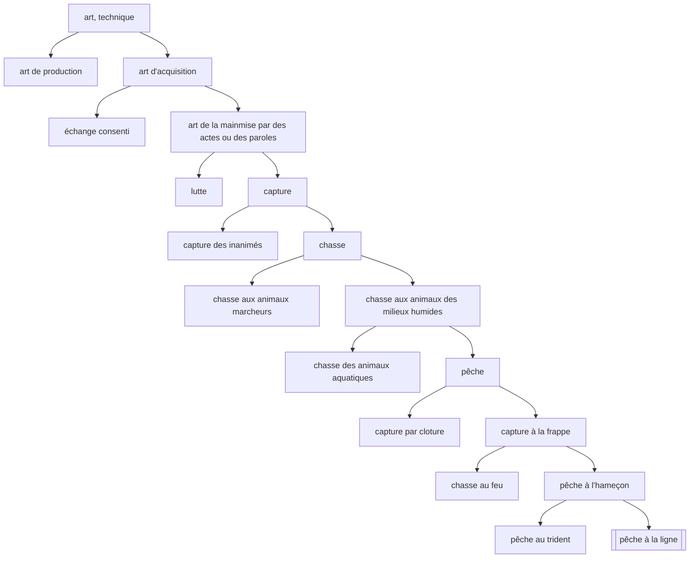

---
tags:
  - sorbonne
  - philosophie
  - histoire-philosophie-antique
  - td
semestre: 2
---
## Texte 1 - 218b6 à d5
#### Introduction
On avance étape par étape
|> on donne la situation du passage (contexte historique et dans l'œuvre)
|> pour parler du problème (difficulté du texte, la tension)
|> pour ensuite évoquer la thèse (solution du problème)
|> finalement, on évoque le plan du texte
-> tout ça est au service de l'auteur

Plan du texte :
1. « Mais c’est en commun » (l. 1) à « en le définissant » (l. 4) -> définition du sophiste sert de point de départ à la recherche commune
2. « Car pour l’heure » (l. 4) à « nom tout seul » (l. 9) -> passer d'une représentation privée à une recherche commune
3. « Quant au genre » (l. 9) à la fin -> besoin de s'exercer à sa méthode sur un paradigme plus simple

Thèse = besoin de définir le sophiste en examinant en commun sa fonction et s'exercer sur un exemple plus simple pour mieux maîtriser la bonne méthode

Problème = comment entreprendre l'entreprise de la définition ?
#### Développement
On se questionne sur l'essence
|> est la question socratique

Aristote, _Métaphysique_, $\mu$, 4, 1078b
|> existe autre chose que le sensible
|> Socrate est le premier à chercher à le définir universellement

Platon, _Cratyle_, 422b - 425b
|> imiter avec la voie, c'est faire voir la chose
|> nom permet de voir l'essence des choses
|> mot est image
(parle aussi de l'art)
|> mais la langue est imparfaite, donc on peut avoir représentation privée du mot = notre pov sur la définition du mot

Il n'y a pas de correspondance entre le mot et la chose
|> la langue est mal instituée -> elle peut parler de plusieurs choses (cf _Cratyle_)
|> justifie la possibilité de contourner le mot -> représentation privée du mot (cf _Cratyle_)
|> besoin d'avoir un accord sur le mot (sa définition) au travers du dialogue
|> *logos* (définition) est une conséquence du dialogue
-> permet de dépasser le propre pour aller au commun 

_Lois_, X, 895d
|> 3 éléments : réalité, définition et nom
|> quand on parle de la réalité, soit on s'interroge sur la définition, soit sur le nom

_Lettre_, VII, 342a-d
|> connaissance d'une chose suppose toujours la connaissance de sa définition, du nom et de sa réalité

Toute pratique est le résultat d'une action
|> l'activité de la chose est ce qu'on cherche à définir
|> besoin de s'accorder sur ce dialogue
|> chose trouve sa réalité dans l'instrument auquel elle est liée
-> besoin de respecter l'action nommée quand on définit le nom et son être
|> nom sert une fonction, un acte propre (fonction diacritique)
|> nom sert aussi une didactique
-> forme du nom rejoint sa fonction (_Cratyle_)

Étranger voit la difficulté intrinsèque de la définition du sophiste
|> Socrate aurait fait la même chose (« les belles choses sont difficiles »)
-> besoin de faire quelque chose de plus simple, sans complexité
|> paradigme sert l'entrainement car évite la complexité
|> paradigme vise la cible mais est plus simple (cible est la définition du sophiste)

> [!warning] Paradigme dans les traductions
> Possède un sens bien différent !
> |> chose permettant de faire voir
> |> est aussi bien un exemple qu'un modèle
#### Après le texte
Pourquoi parler du pêcheur à la ligne pour s'exercer ?
|> est un chasseur, comme le sophiste
|> compte sur la stupidité de la proie, comme le sophiste
|> activité neutre axiologiquement (226b)
-> ressemble au sophiste, mais est beaucoup moins prétentieuse

Platon, _Timée_, 92b
|> quatrième espèce (poisson) est celle qui est tombée au plus bas de l'ignorance
|> poisson croit que la surface de la mer est un ciel (_Phèdre_, 109d)
-> plus généralement, parle de la réincarnation de l'âme

> [!info] Méthode en grec antique
> est le chemin à suivre, mais avec des choses bloquant la route (les problèmes)

Méthode de la définition : division dichotomique
|> quel genre ?
|> quelle différence ?
|> quel nom ?
|> où est la cible ?

Application de la méthode à la pêche à la ligne

> [!note] Critique par Aristote
> _Parties des animaux_, I, 2-4 et _Premiers analytiques_, I, 31
> 
> Absence de classification : répétition, addition de différences, conjonctions, division est faite par accident
> |> pas de vision organique
> 
> Non heuristique = présuppose la nature de ce qui est divisé
> 
> Non démonstratif = ne démontre absolument rien

Maintenant, on peut appliquer la méthode au sophiste
|> donne les six premières définitions du sophiste
|> ces définitions donnent chacune un aspect du sophiste
-> il manque systématiquement le point focal liant toutes ses définitions

La dichotomie entre offrir des présents et chercher un salaire dans la première définition du sophisme montre que le philosophe n'est pas désintéressé
|> Socrate se cache dans "offrir des présents" (_Le Banquet_)