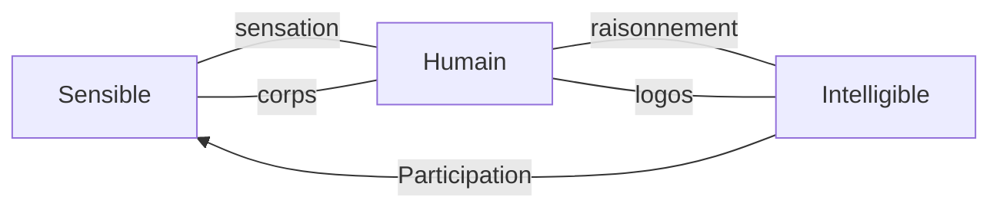

---
tags:
  - sorbonne
  - philosophie
  - histoire-philosophie-antique
  - td
semestre: 2
---
Le sophiste possède trop de références
232b -> est aussi une sorte de contradicteur redoutable
232e -> et possède une prétention universelle
|> peut tout contester
-> miraculeux, étonnant

> [!info] Savoir doxastique
> Est un oxymore
> |> savoir relatif à la croyance et non à la vérité
> |> donc pas un savoir
> -> est un savoir apparent, non réel
> |> contradiction dans les termes
## Texte 3 - 233d9-235a9
Dans ce texte, on avance sur la définition du sophiste, car il précise la vision du sophiste comme producteur d'opinion

Jouer = se donner des règles qui ne reposent sur rien
|> aussi l'illusion théâtrale
-> produit l'image
|> est ce qui est utilisé par le sophiste pour produire ses images

Sophiste est donc un imitateur
|> donne l'illusion de l'être à ceux ne faisant pas usage de leur faculté rationnelle
|> mots peuvent aussi illusionner -> sont aussi des images
|> cherche souvent à illusionner les jeunes (car la jeunesse éloigne de la sagesse)

*eidôlon* (image)
|> est l'illusion
|> *eikôn* est la production de copie

Platon, _République_, X suit toute cette vision de la tromperie
|> si quelqu'un possède tout et possédant tous les détails, alors il est naïf et s'est fait trompé par un imitateur

Donc, ceux affirmant tout connaître se sont fait tromper par les sophistes

*amathia* = refus d'apprendre, est l'ignorance

Pour éviter de se faire avoir par le sophiste, on a besoin de sortir de l'opinion
|> opinion = faire du mimétisme (produire des images / imitations)
|> ne possède aucun sérieux, est inutile
|> est une action bariolée, peinte, bref elle est plurielle
## Texte 4 - 235b8-236c10
brachylogie / macrologie
|> premier est le discours socratique
|> deuxième est celui des sophistes, cherchent l'œuvre monumentale, celle qui est belle et qui procure du plaisir

Division de la mimétique
|> eikastique = production de copies / semblants (*eikôn*)
|> phantastique = apparences, simulacres, illusions (*phantasma*)

>On évitera de parler de monde intelligible chez Platon. *3 secondes après.* Le monde intelligible...

(NB: participation part du logo normalement et lie intelligible et sensible)

eikastique respecte les proportions et les couleurs -> part du modèle
|> est géométrique
|> le respect est super important, car permet le reste
|-> *eoika* (ressemble)

phantastique part du point de vue
|> est esthétique (comme les œuvres de grandes tailles)
|> voir la statut d'Athéna de Phidias
|> est un sacrifice du vrai pour l'esthétique (modification de la nature pour satisfaire)
|> prétend ressembler, mais n'est pas -> *phainomai* (paraître)
|-> parait pour quelqu'un, n'est pas en soit 
-> ne possède aucun rapport avec le modèle, car est le point de vue est relatif

> [!info] Distinctions eikastique / phantastique et objet / sujet
> Ces deux distinctions se ressemblent beaucoup, mais on ne peut pas l'utiliser pour Platon
> |> ces termes ne sont pas dans les textes
> |> présupposent tout un point de vue beaucoup plus récent qui créerait un anachronisme

> [!NOTE] Usage de *eikon*, mimétisme et tragédie en Grèce antique
> Tous ces concepts sont apparus avec le problème apparence / essence
> |> n'existait pas avant
> |> fin VIe, début Ve siècle avant J-C.
> |> création par les Éléates
> 
> Est l'opposition idole / icone, n'était pas utile avant
> |> Homère ne l'utilise pas dans ce sens

Platon en condamnant l'illusion, il condamne aussi les artistes de son époque
|> critique de la *skiagraphia* (technique permettant de rendre le volume des choses)

> [!warning] Critique de l'image (*eidolon*) chez Platon
> Platon ne critique jamais l'*eikon* (copie) !
> Sa critique se concentre sur le simulacre, l'illusion (*phantasma*)

La distinction entre l'*eikon* et le *phantasma* dépend de la relation entre l'image et son modèle

Rapport entre l'*eikon* et l'original est le même que celui entre sensible et intelligible
|> utilité du portrait (_Phédon_, 73e)
|> drame du sophiste est le refus de la différence entre l'image et son modèle
|> prisonnier de la caverne sont ceux qui refusent la distinction image/modèle (donc les sophistes sont les prisonniers de la caverne), cf _République_ pour « l'analogie de la caverne »

L'*eikon* peut servir d'*eidos* (schéma) pour comprendre l'Idée derrière

« Le médium de l'image est l'unique expression spécifiquement humaine que nous puissions donner au spirituel suprême »
|> l'image s'ajoute à ce qui est nécessaire pour qu'on puisse comprendre de quoi on parle