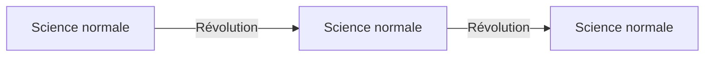

---
tags:
  - sorbonne
  - philosophie
  - philosophie-sciences
semestre: 2
---
## A. L'induction 
### 1. Présentation
Les arguments inductifs sont défaisables (ils peuvent dire quelque chose de faux) et ampliatifs (ils augmentent les connaissances)

La science se présente comme étant inductive
|> s'appuie sur des expériences sensibles
|> vise à créer des lois générales

Fonctionne beaucoup à l'aide de la généralisation empirique

> [!example] Exemple de généralisation empirique
> J'ai observé $n$ morceaux de cuivre dans de l'eau
> $\forall n$, le $n$-ième morceau de cuivre flotte dans l'eau
> Tous les morceaux de cuivre flottent dans l'eau

Existe aussi les inférences fondées sur la vérité d'une prédiction
|> Soit $H$ une hypothèse
|> Soit $P$ une propriété telle que $H\implies P$ et que $P$ soit vérifiable empiriquement
|> Si $P$ est vraie, alors $H$ est vraie

> [!example] Exemple d'inférences fondées sur la vérité d'une prédiction
> Si la théorie d'Einstein ($H$) est vraie, alors la lumière est déviée quand elle passe près du Soleil ($P$)
> $P$ est vraie
> Donc $H$ est vraie
### 2. Le problème de Hume
Hume, _Enquête sur l'entendement humain_, IV, 2
|> deux objets de la raison : relations d'idées (vrai car contradiction est fausse) et choses de fait (vrai, mais contradiction peut être vraie) [^(1)]
|> choses de fait proviennent des inductions (mot qui n'existe pas à l'époque de Hume)

[^(1)] est plus compliqué en réalité, voir la diapo (cours 2)

Le principe d'induction transforme les inductions en déduction
|> sorte de « les objets en apparence semblables à ceux que j'ai observés s'accompagneront d'effets semblables »
-> on ne peut pas trouver de contradiction avec une démonstration, donc il est vrai

Pourtant, on utilise de l'induction pour démontrer l'induction
|> erreur logique !
-> pas de justification de l'induction

Est une thèse sceptique radicale qui est contre intuitive et qui a été beaucoup discutée

Hume propose dans _Enquête de l'entendement humain_, V 
|> l'observation de la régularité implique la création d'une disposition dans l'esprit humain
|> cette tendance est automatique
-> disposition naturelle, principe de la nature humaine

Kant critique le problème de Hume dans _Critique de la raison pure_, deuxième analogie de l'expérience en particulier
|> toute chose qui arrive possède une cause et cette cause est nécessaire -> principe de causalité
|> on peut donc connaître des vérités nécessaires et universelles sur le monde empirique
-> est un principe d'induction

> [!quote] Critique de Hume par Kant
> Hume concluait donc faussement de la contingence de ce que nous déterminons d'après la loi à la contingence de la loi elle-même

Transcendental = argument raisonnant sur les conditions de l'expérience et de la connaissance

Toute expérience d'un événement (expérience que quelque chose arrive par exemple) est l'expérience d'une succession qu'on conçoit comme objective, i.e. le phénomène qui arrive en suppose un autre autre qu'il suit nécessairement, suivant une règle
|> cet événement est indépendant de moi
-> est une solution non empiriste car elle ne dépend pas de moi : elle provient de notre essence

Reichenbach explique qu'il n'est pas possible d'établir que le futur ressemblera au passé
|> montre que cette condition n'est pas nécessaire -> le sépare de Hume
|> on a peut être $A\implies B$, mais on est sûr que $A\impliedby B$
-> affaiblit le principe d'induction
|> est pratique et est notre meilleur pari
|> le succès prédictif est seulement possible en supposant que le futur ressemblera au passé (seulement = unique méthode)

Si la nature ne ressemble pas un minimum au passé, alors on ne peut rien connaître

**Aucune de ces solutions ne sont acceptées comme une solution au problème de Hume**
|> généralement admis que les arguments inductifs posent un problème de justification
|> très compliqués pour les empiristes
|> n'y a pas de certitude concernant les théories scientifiques
## B. Le falsificationnisme
Le falsificationnisme est extrêmement lié à Popper

S'oppose au vérificationnisme : ce qui est vrai est ce qui n'est pas faux
|> ici, on cherche à montrer que c'est faux et non que c'est vrai

Vérifier un énoncé a bcp de problèmes
|> notamment le problème de Hume
|> les énoncés scientifiques ne sont pas vérifiables (ou n'ont pas de sens)

| Vérification             | Réfutation                     |
| ------------------------ | ------------------------------ |
| Si $H$, alors $P$ $P$ | Si $H$, alors $P$ $\lnot P$ |
| $H$                      | $\lnot H$                      |
La vérification est inductive
La réfutation est déductive
-> est asymétrique, mais les deux utilisent des hypothèses similaires

Popper utilise la réfutation car elle permet d'éviter le problème de Hume
|> critère de démarcation = énoncé est scientifique s'il est falsifiable
|> est empiriste, mais ne suppose pas l'induction
-> Popper trouve que Hume a raison

Exemple : « Il ne pleut jamais mercredi » -> falsifiable, donc est scientifique
Exemple : « Soit il pleut, soit il ne pleut pas » -> n'est pas falsifiable, donc n'est pas scientifique (est analytique)

>Vous allez dire que l'horoscope n'est pas scientifique

> [!warning] Les discours n'ont scientifiques 
> Popper ne dit pas qu'ils ne sont pas utiles ou qu'ils n'ont pas un fond de vérité, il dit surtout que ce ne sont pas des sciences

Comment devons-nous justifier les hypothèses scientifiques ?
|> hypothèse doit être cohérente, empirique, meilleure que les autres
|> on teste les nouvelles prédictions de la théorie en commençant par les plus surprenantes

Théorie est meilleure quand :
- elle est vraie
- elle fait plus de prédictions ou si elle fait les mêmes mais en étant plus précis
- elle est plus audacieuse -> est liée à l'histoire

Popper a une approche compétitive : c'est théorie contre théorie

Rien ne permet de dire qu'une théorie est vraie, ça permet juste d'évoquer la nature d'une théorie
## C. Les limites du falsificationnisme
**1. l'épreuve des faits** = ne résiste pas bien à ce qu'est la science
|> le critère de démarcation n'est-il pas trop sévère ? -> et les sciences humaines et historiques ?

**2. sauvetage des hypothèses** = si une hypothèse est fausse, souvent on essaye de la sauver -> mauvaise description
|> est-ce une mauvaise norme ?
|> on peut sauver des hypothèses si l'hypothèse supplémentaire permet de faire des autres prédictions (sinon, l'hypothèse ajoutée est *ad hoc*)
|> aussi possible que l'expérience ne fonctionne pas, i.e. il y a des hypothèses supplémentaires
-> le falsificationnisme ne dépend pas que des faits et de la logique déductive, donc induction !
|> est le problème de Duhem (voir [[5- Limites du falsificationnisme]]) ou l'holisme du falsificationnisme
|> un sauvetage est donc toujours possible

**3. hypothèse probabiliste** = casse totalement le falsificationnisme
|> $P(\text{pile}) =\frac{1}{2}$ empêche les prédictions sur le prochain lancé
|> ne peut pas être falsifié
-> falsification « en pratique » a besoin d'utiliser les probas et les stats
## D. Ingrédients non empiriques de la validation des théories scientifiques ou introduction à la philosophie des sciences de Thomas Kuhn
Falsificationnisme = science avance par essais et erreurs
|> resistance aux tests empiriques est le plus important (est la « corroboration »)
-> pourquoi devrait-on choisir une théorie comme celle-là pour progresser ?
|> pas possible de rejeter une telle préférence sans l'induction
|> *in fine*, on a besoin de l'induction, donc problème de Hume

Et si toute la science ne découle pas de l'expérience ?
|> existe d'autres ingrédients ne dépendant pas de l'expérience pour pouvoir avancer
-> présentation des grandes thèses de Thomas Kuhn

Thomas Kuhn = philosophe des sciences de la deuxième partie du XXe siècle
|> doctorat en physique
|> enseignant d'histoire des sciences
|> _La structure des révolutions scientifiques_ (SRS), 1962
|> _La tension essentielle. Tradition et changement dans les sciences_, 1977 (recueil d'articles et de textes)

Science normale = plus pratiquée et la plus normée
Science révolutionnaire = exceptionnelle et sans normes, en renversant les normes
-> ne sont pas unifiables : sont complètement différents
|> les normes sont appelées « paradigmes »

Paradigme permet aux scientifiques d'exercer normalement leur métier
|> détermine les questions susceptibles de recevoir une réponse scientifique
|> détermine les méthodes à utiliser
|> détermine les réponses considérées comme satisfaisante
|> définie aussi le groupe

Grandes définitions de paradigme
|> cadre cognitif = fournit une façon de penser le monde et de pratiquer les sciences empiriques
|> matrice disciplinaire

Cadre cognitif contient :
- des cas paradigmatiques qui ont été des succès expérimentaux, qui fixent des phénomènes connus et expliqués et des instruments de mesure typiquement utilisés
- hypothèses métaphysiques relatives à la nature des entités existantes et des processus qui donnent lieu à des phénomènes étudiés

Exemples = paradigme newtonien avec l'exemple de Galilée

Matrice disciplinaire
|> implique possession commune de la part des spécialistes d'une discipline particulière
|> ensemble se compose d'éléments ordonnée de diverses sortes, dont chacune demande une étude détaillée
|> appartenir à une communauté scientifique, c'est penser dans les termes du paradigme
|> paradigme comprendre des œuvres fondatrices (traités) et des ouvrages pédagogiques (manuels) dont l'étude prépare les étudiants à devenir membre de la communauté

Les 4 types d'éléments de la matrice disciplinaire :
- modèles (exemples)
- analogies (éléments théoriques)
- hypothèses métaphysiques
- valeurs communes (appartenance à un groupe)

Valeurs =
- incorporés dans les théories (déterminisme, bourgeois vs prolétarien, sexisme)
- portant sur les théories, pas sur leur contenu (beauté, simplicité, cohérence, utilité sociale)
- relatives à la pratique de la science en général (honnête, indépendance, éthique)

Sciences normales est fondamentalement conservatrice
|> ne cherche pas à réfuter la théorie
|> essaye de résoudre les énigmes (qu'elle soit théorique ou expérimentale) -> celles qui sont très complexes sont des anomalies, souvent elle ne pose pas de problème
|> pression social car on doit appartenir au groupe

On apprend la science par les exemples et les exercices
|> pas vraiment d'esprit critique, mais plutôt la capacité à penser dans les termes du paradigme
-> la remise en question du paradigme est rare

> [!NOTE] Étapes du changement de paradigme
> **L'entrée dans la crise** = fragilisation du paradigme
> 
> **Période de révolution** = deux paradigmes rivaux
> -> besoin d'avoir un autre paradigme pour que ça change
> 
> **Sortie de la révolution** = paradigme sortant devient la norme

Le changement de paradigme commence suite à un grands nombres d'anomalies et l'émergence de théories concurrentes incompatibles avec le paradigme existant

La compétition de paradigmes casse l'autorité de l'ancien au profit du nouveau
|> cohérence interne devient de moins en moins évide
-> l'activité scientifique n'est plus régulée (d'où le terme révolution)

Changement arrive suite à un rapport de force
|> ressemble à un conversion pour les individus
|> le changement ne suit d'aucune règle rationnelle
|> facteurs déterminant l'adoption ne sont pas d'ordre épistémique ou empirique

Ne peut pas être rationnel car les anciens ne comprennent pas les nouveaux (ne peuvent pas communiquer)
-> est l'incommensurabilité
|> peut être linguistique (sens des mots), sur les expériences (n'analysent pas de la même manière)...

Critère de démarcation est la capacité à progresser dans les paradigmes

Il n'existe néanmoins des valeurs universels comme le principe de non contradiction (ou l'empirisme pour Kuhn)
|> est un relativisme relatif