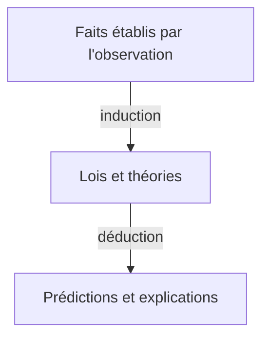

---
tags:
  - sorbonne
  - philosophie
semestre: 2
---
Hume, _Enquête sur l'entendement humain_

On passe du descriptif au normatif
|> Hume parle d'énoncés moraux car le *il doit* de la morale provient de la norme (normatif) !

Présentation de Hume
|> tradition philosophique britannique du XVIIIe siècle
|> s'inscrit dans la tradition empiriste
|> construit une véritable philosophie de la connaissance

Chapitre IV questionne la création dans l'esprit de la croyance de la régularité de la nature
|> est appelé le problème de l'induction
|> contient une distinction appelée _la fourche de Hume_
## David Hume, Enquête sur l’entendement humain, IV
§1 = saut logique entre induction et déduction
|> la déduction est toujours inféré de l'induction dans la méthode empiriste
|> cherche à expliquer la chaîne de raisonnement dans ce saut logique : «  La connexion entre ces propositions n’est pas intuitive »
|> « On réclame un moyen terme qui puisse rendre l’esprit capable de tirer une telle inférence si, en vérité, elle se tire par raisonnement et argumentation »
|> cherche le raisonnement derrière
-> comment arrive-t-on à faire ce saut ?
|> on va procéder par élimination : « énumération de toutes les branches de la connaissance humaine »

§2-3 = il n'existe que deux types de raisonnement
|> démonstratif (relations d'idées) = purement logiques, sont des énoncés analytiques -> ne peut pas être contredit par l'expérience
|> moraux (questions de faits et d'existence) = ajout du contenu au sujet (n'est pas inclue dans le sujet), sont des énoncés synthétiques

§4 = matérialisation du problème de l'induction
|> nos raisonnements moraux découlent du raisonnement causal
|> on justifie la régularité par la régularité (nature est régulière car on la suppose régulière)

§5 = comment faire pour rester empiriste ?
|> ce n'est pas parce que nous ne l'avons pas fondé que nous ne pouvons pas les utiliser
|> ils sont peut être faux, mais c'est très utile
-> besoin d'accepter l'induction si on veut pouvoir parler du futur : tout notre raisonnement fonctionne comme ça (Russell)