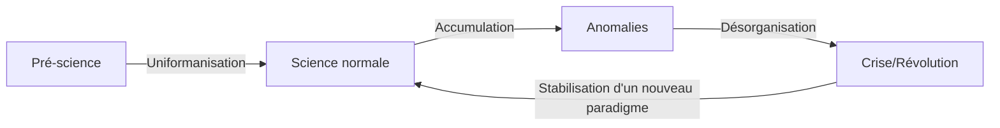

---
tags:
  - sorbonne
  - philosophie
  - philosophie-sciences
  - td
semestre: 2
---
Traditionnellement, pour choisir entre plusieurs théories scientifiques, on s'accorde sur des critère épistémiques
|> critères méthodologiques touchent à la manière dont on mène une recherche et dont on s'assure que les résultats sont fiables
|> critères théoriques touchent à la qualité formelle et à son efficience
## Thomas Kuhn, _La structure des révolutions scientifique_, 1 & 7 & 8
La date de publication est importante ! **1962**

Cherche à montrer que des modèles inductiviste et falsificationniste n'arrivent pas à montrer la complexité de la science
|> fertilité d'une confrontation des sciences à une analyse historique

Objectivité est ce qui fait consensus, ce qui est neutre, ce qui est relatif à l'objet
|> politique ne doit pas rentrer dans les sciences pour la contaminer
-> Kuhn explique que la science n'est pas objective

Étape des sciences :
- pré-science = chaque scientifique possède sa propre théorie -> pas de socle commun
- science normale -> socle commun
- crise - révolution -> socle commun est abandonné à cause d'anomalies
- nouvelle science normale -> nouveau socle commun
-> alterne entre science normale, crise et révolution

Développement de paradigme est aussi une construction socio-historique
|> la conservation de l'énergie existe suite à la découverte du transfert entre énergie thermique et énergie mécanique

Deux paradigmes sont incommensurables
|> les questions ne sont pas les mêmes dans deux paradigmes différents

Critiques :
- Lakatos -> relativisme scientifique mène à la conception d'une science comme purs rapports de pouvoirs
- Chalmers -> problème de la cohérence de la thèse kuhnienne qui propose de penser une science à la fois révolutionnaire mais aussi progressiste

Kuhn, pour sortir de ce problème, propose 5 critères :
- beauté
- porté
- cohérence
- fécondité
- simplicité
-> sont sujets à l'interprétation et peuvent se contredire

**Chapitre 1**
Arrête avec la conception de la science comme accumulation de connaissance
|> conception discontinue par révolution (rupture)
|> création des concepts de paradigmes, sciences normales et sciences en crise
|> cf [[2- Les principales conceptions philosophiques de la validation empirique des théories scientifiques]]

**Chapitre 7**
Comment les scientifiques réagissent-ils à la proposition de nouvelles théories ?
|> s'oppose au falsificationnisme
|> l’avènement de nouvelles théories ne sont pas de suite adoptée, y compris si les anciennes sont fausses

Pour qu'un nouveau paradigme arrive, il est nécessaire qu'un autre puisse prendre la place du paradigme en place

**Chapitre 8**
« Les paradigmes successifs » (l. 1) à « donner d’autres exemples. » (l. 5) 
-> visions différentes des faits selon les paradigmes

« Mais les paradigmes ne » (l. 5) à «  travail scientifique significatif. » (l. 13)
-> visions différentes sur la pratique de la science

« À mesure que » (l. 13) à « souvent aussi incommensurable. » (l. 17, fin)
-> visions différentes sur les normes épistémologiques (démarcation)