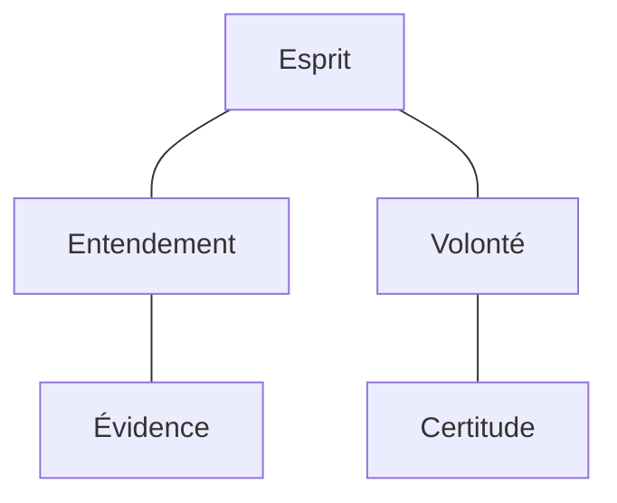

---
tags:
  - sorbonne
  - philosophie
  - philosophie-générale
  - td
semestre: 2
---
Moyenne à 13
|> notes vont de 2 à 17.5

L'évidence chez Descartes est une propriété de la perception
|> il n'existe aucune zone d'ombre
|> perception est évidente quand elle est claire et distincte

Certitude chez Descartes est opposé au doute
|> est l'équivalent de l'évidence dans l'entendement pour la volonté
|> est l'expérience de la vérité

Quand on fait une accroche, on a besoin de la continuer lors de la problématisation

Définition doit partir du sens commun pour rester large
|> on évite de chercher l'essence
|> on prépare le problème
|> on évite de trop s'inspirer des auteurs pour éviter de refermer le sujet

Problème ne doit pas répéter la question
|> doit former une alternative entre deux points de vue contradictoire

Peut-on = capacité logique et devoir moral
1. douter de la vérité d'une opinion
2. douter de la vérité en générale
	1. douter de ce qu'est la vérité (sa nature)
	2. douter de son objectivité (aptitude à représenter des choses hors de moi)

Expliciter les distinctions conceptuelles