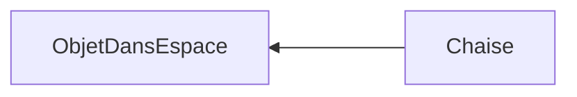
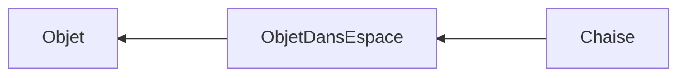

---
tags:
  - sorbonne
  - philosophie
  - informatique
semestre: 2
---
Idées : vulgariser la théorie des Idées de Platon aux développeurs
|> demande aussi de vulgariser la programmation objet pour le professeur de philosophie
|> est lié à mon objectif de devenir prof : vulgarisation est proche de l'enseignement
## Introduction
Je fréquente beaucoup de développeurs et une bonne partie d'entre-eux est intéressée par la philosophie, mais il ne savent pas du tout par où commencer. Cette absence de repère est totalement compréhensible quand nous faisons face à une montagne de connaissance s'étalant de l'Antiquité lointaine à maintenant. Trouver une entrée accessible dans ces plus de 2500 ans d'histoire est une tache dantesque pour une personne seule.

En tant qu'étudiant en double licence Science-Philosophie, plus précisément en Informatique-Philosophie, je trouve qu'il est de mon devoir de lier ces deux disciplines que tout semble éloigner, notamment pour ceux venant de l'un cherchant à comprendre l'autre. Ce travail personnel encadré (TPE) de la faculté des lettres a été pensé en parallèle avec le sujet que je traite dans l'atelier de recherche encadré (ARE) de la faculté des sciences et ingénierie. Ici, j'essaierai de lier la philosophie à l'informatique tandis que mon projet de l'ARE s'occupera de lier l'informatique à la philosophie.

Pour initier les développeurs à la philosophie, j'ai décidé de vulgariser la théorie des Idées de Platon en utilisant un paradigme fondamental en informatique : la programmation objet (POO). Ce concept particulièrement utilisé en entreprise et très répandu me semble comme étant la meilleure manière d'initier à l'entreprise philosophique de Platon, auteur essentiel de la philosophie antique ayant servi de fondement à la majorité de la philosophie continentale. En effet, de nombreux concepts de cette programmation se rapproche grandement de la théorie platonique de la connaissance : les objets en POO seraient les Idées de Platon et l'instance d'un objet serait l'équivalent de son image.

Avant de plus détailler les liens entre la théorie des Idées et la programmation objet, il me semble essentiel de vulgariser le fonctionnement de cette théorie pour les philosophes. Ensuite, je détaillerai ces liens étonnant pour finalement critiquer cette analogie surprenante.
## La programmation objet
Quand une développeur conçoit un programme, un logiciel, un site web, il a le choix entre plusieurs approches. Toutes possèdent des avantages comme la robustesse de sa conception et des inconvénients comme la difficulté d'utilisation de la technologie. La programmation objet (POO) est une approche spécifique d'un problème : elle vise à construire des objets génériques qui représentent les états du système. Cette vision de la programmation est si importante qu'elle est considérée comme un paradigme : ce choix modifie grandement l'approche du problème et donc sa résolution.

La POO est très utilisée en entreprise pour sa robustesse et sa portabilité. En effet, en créant un objet représentant un état précis d'un sous-système, on contraint le système à être dans un état forcément connu. De plus, de nombreux langages mettant en place de la POO ne dépendent pas du système d'exploitation ou de l'architecture de la machine pour fonctionner, comme Java, Python ou Ruby. Par contre, son principal désavantage est son absence de flexibilité directement impliquée par sa grande robustesse. De plus, cette approche est souvent plus lourde sur les performances et sur l'écriture du programme.

Mais, concrètement, à quoi ressemble de la POO ?

Prenons l'exemple d'un jeu vidéo. Son créateur souhaite intégrer une chaise pour que le joueur puisse s’asseoir. Le développeur devra donc créer l'objet chaise décrivant toutes les propriétés et tous les états possibles de la chaise. Il s'agit philosophiquement parlant de l'*essence* de la chaise. Cette déclaration s'écrit dans une classe, qui n'est que la représentation formelle de l'objet. Dans notre cas, la chaise doit être repérée dans l'espace : on doit donc lui rajouter des coordonnées.
```
classe Chaise = {
	Nombre x
	Nombre y
	Nombre z
}
```
Ce pseudo-code représente la chaise telle qu'on la définit au-dessus : elle possède trois coordonnées nommées `x`, `y` et `z` qui sont des nombres.

Cette définition très simple nous limite grandement : on ne peut pas s'asseoir dessus par exemple. On doit donc lui rajouter une nouvelle propriété binaire indiquant si quelqu'un est assis dessus ainsi que cette personne. On obtient donc :
```
classe Chaise = {
	Nombre x
	Nombre y
	Nombre z
	
	Binaire une_personne_est_elle_assise
	Personne personne_assise
}
```
Notre chaise est maintenant plus intéressante, mais on ne peut toujours pas s'asseoir dessus : on peut juste représenter une personne assise. Pour rajouter cette fonctionnalité, on doit créer une méthode pour s'asseoir dessus. Pour appliquer la méthode, on a besoin de lui donner la personne à asseoir :
```
classe Chaise = {
	Nombre x
	Nombre y
	Nombre z
	
	Binaire une_personne_est_elle_assise
	Personne personne_assise
	
	méthode asseoir_une_personne(Personne personne_a_s_asseoir)
}
```
Maintenant, notre chaise est totalement fonctionnelle : on peut la mettre dans l'espace et faire s'asseoir quelqu'un dessus, mais on ne peut pas la créer ! Pour ce faire, on rajoute une méthode de création appelée constructeur, qui ici a besoin des coordonnées dans l'espace :
```
classe Chaise = {
	Nombre x
	Nombre y
	Nombre z
	
	Binaire une_personne_est_elle_assise
	Personne personne_assise
	
	méthode asseoir_une_personne(Personne personne_assise)
	
	méthode constructeur(Nombre x, Nombre y, Nombre z)
}
```
Notre classe `Chaise` est prête à être utilisée. On peut maintenant créer une nouvelle chaise en lui indiquant où elle est. Cette nouvelle instance ne modifie pas la classe `Chaise` : elle ne fait qu'utiliser ses propriétés. L'instance de la classe est accidentelle par rapport à sa classe.

Après, si on le souhaite, on peut créer des relations entre les classes pour simplifier la représentation. Je peux, par exemple, créer une classe `ObjetDansEspace` qui possédera déjà les propriétés pour être représentée dans l'espace. On dit alors que la classe `Chaise` étend de la classe `ObjetDansEspace` ce qui peut être représenté comme ceci :
```
classe Chaise étend de ObjetDansEspace = {
	Binaire une_personne_est_elle_assise
	Personne personne_assise
	
	méthode asseoir_une_personne(Personne personne_assise)
}
```
Nous n'avons plus besoin de définir les coordonnées et le constructeur car la classe `ObjetDansEspace` s'en occupe à notre place. Si on devait schématiser, on aurait quelque chose comme ça :

La flèche indique que la chaise est un objet dans l'espace.

D'un point de vue plus théorique, toutes les classes sont des objets - d'où le nom de programmation objet ! -, donc on aurait :


Maintenant que l'on possède les bases en programmation objet, on peut passer à la théorie des Idées.
## La programmation objet comme analogie de la théorie des Idées
## Critique de l'analogie
## Conclusion