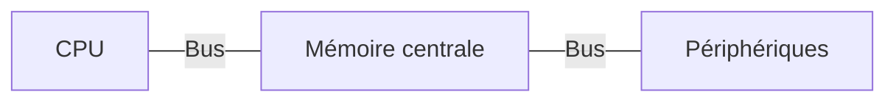

---
tags:
  - sorbonne
  - informatique
  - architecture-des-ordinateurs
semestre: 3
---
Architecture générale d'un ordinateur sur Moodle
|> on s'intéresse au CPU, chipset et à la mémoire principale
|> les choses sont liées grâce à des bus (un bus est un fil électrique)



CPU est celui qui traite l'information -> exécute les programmes
Mémoire centrale est la RAM -> stocke les informations nécessaires à l'exécution du programme
Bus -> support physique permettant les transferts d'information entre les différentes unités
Périphériques -> les unités connexes

Programme possède deux informations différentes :
1. les données
2. le traitement à effectuer (suite d'opérations sur les données)

Les données sont représentées en binaire -> stocké dans la RAM
Traitement à réaliser est traduit en une suite d'instructions compréhensibles par le processeur cible -> est le langage machine

Schéma détaillant le stockage sur moodle

Dans la mémoire, le code et les données sont bien séparés

Processeur contient l'ALU (ce qui permet de faire des calculs arithmétiques et logiques) et les registres
|> les registres permettent de stocker les données d'une manière très temporaire (contiennent max 32 ou 64 bits)
|> l'ALU effectue des opérations sur les données dans le registre
|> l'unité de commande dans le CPU définit ce qu'il doit faire à chaque instant

L'unité de commande contient deux registres principaux -> Program Counter (PC) et Instruction Register (IR)
|> PC contient l'adresse du programme exécuté
|> IR contient les instructions à exécuté
-> le CPU exécute sans fin :
1. lecture de l'adresse du code dans PC
2. le place dans IR
3. la lecture des instructions mise dans IR
4. décode l'instruction
5. exécute l'instruction
6. mise à jour de l'instruction suivante (update dans PC)

Ceci est une architecture de Von Neumann

Les composants manipules surtout des tensions électriques
|> deux valeurs possibles pour la tension
|> 0V et 1.5V sont les deux valeurs utilisées (0V = 0 et 1.5V = 1)

Représentation binaire :
|> mot binaire = mot formé sur $\{0;1\}$
|> bit = $0\lor1$
|> octet = mot binaire composé de 8 bits
|> quartet = mot binaire composé de 4 bits

CPU 32 bits gèrent tout le temps 32 bits
CPU 64 bits gèrent tout le temps 64 bits
-> tout est décrit par ça

Soit $M$ un mot binaire de $n$ bits, $M$ est décrit par la suite de bits $(m_{i})_{0\leqslant i\leqslant n-1}$
|> plus $i$ est grand, plus le poids de ce bit est fort

> [!NOTE] Nom des bits
>$i = 0$ bit de poids faible
>$i = n-1$ bit de poids fort

Le bit représente l'information brute mais son interprétation dépend du reste !
|> permet quand même de tout représenter (enfin, tant que l'ensemble de départ est en bijection avec $\mathbb{N}$)
## Logique booléenne
Logique booléenne -> formalisation des raisonnements basés sur des éléments qui peuvent être soit vrais, soit faux
|> l'alphabet $\beta$ est $\{\text{VRAI},\text{FAUX}\} = \{\text V,\text F\} = \{0;1\}$
|> ordre des éléments de $\beta = 0 < 1$
|> variable booléenne est dans $\beta$
|> fonction booléenne va de $\beta^n$ vers $\beta$

Fonctions essentielles :
|> complément (ou NON, ou NOT) -> $a = 0\implies\bar a = 1$ et $a = 1 \implies \bar a = 0$
|> addition (ou OU, ou OR) -> $a+b=\max(a,b)$
|> multiplication (ou ET, ou AND) -> $a\cdot b = \min(a,b)$

| a   | b   | $\bar a$ | $a+b$ | $a\cdot b$ |
| --- | --- | -------- | ----- | ---------- |
| 0   | 0   | 1        | 0     | 0          |
| 1   | 0   | 0        | 1     | 0          |
| 0   | 1   | 0        | 1     | 0          |
| 1   | 1   | 0        | 1     | 1          |
Toute fonction booléenne peut être décrite par une composition des fonctions élémentaires ET, OU, NON car $<\beta, 0, 1,+,\cdot,\bar{}>$ forme une algèbre (voir séance 8 et suivantes)

> [!NOTE] Définition des fonctions sur $n$ bits
> On note $(a_i)_{i\in[0,n-1]}$ l'ensemble des bits de $A$. Notation analogue pour $B$ et $C$.
> 
> **NOT** -> $C = \bar A$ tel que $\forall i\in[0,n-1], c_i=\bar a_i$.
> **OR** -> $C = A+B$ tel que $\forall i\in[0,n-1], c_i = a_i+b_i = \max(a_i,b_i)$
> **AND** -> $C = A\cdot B$ tel que $\forall i\in[0,n-1], c_i = a_i\cdot b_i = \in(a_i,b_i)$
> 
> D'une manière générale, le résultat d'une opération sur un mot $M$ est le résultat des opérations sur les bits de $M$
> -> est vrai pour toutes les fonctions booléennes (i.e. pour tout $f:\beta^n\to\beta$)
### Décalage logique
Soit $A$ un mot binaire de $n$ bits avec la famille $(a_i)_{i\in[0,n-1]}$ qui forme les bits de $A$.
Si $p > n-1$, on a que $[p,n-1] = \varnothing$ par abus de langage

$B = A \ll p$ tel que 
|> $\forall i\in[0,p-1], b_i = 0$
|> $\forall i\in[p,n-1], b_i = a_{i-p}$

$B = A \gg p$ tel que
|> $\forall i\in[0,p-1], b_i = a_{i+p}$
|> $\forall i\in[p,n-1], b_i = 0$

> [!tip] Garder uniquement certains bits de $A$
> On crée un mask $m$ qui sélectionne les bits, puis on fait $A + m$ et on décale
> 
> Si $A = 0101$ et qu'on souhaite avoir $10$, on fait $m = 0110$
> |> $A+m = 0100$
> Puis on décale de 1 pour supprimer la valeur inutile
> |> $A \gg 1 = 0010$

> [!warning] Comment faire un bon mask ?
> Toujours ne mettre que des 1 là où on veut garder des valeurs, sinon on risque de perdre des infos !
> 
> Exemple :
> - $0101 + 0100 = 0100$ marche
> - $0111 + 0100 = 0100$ ne marche pas
> - $0011 + 0100 = 0000$ ne marche pas
> 
> C'est vraiment pas ouf !
## Codage
Le codage est la correspondance entre le représentation externe de l'information et sa représentation
|> c'est comment on souhaite utiliser l'information qui définit quel codage on utilise !
-> est ce qui définit les grandes classes de processeur (Intel, ARM, RISC...)

> [!NOTE] Les bases $B$ sont toujours strictement supérieures à 1 !
> Sinon, on ne peut représenter que $0$

Tout entier naturel $N$ peut être exprimé comme une somme de multiples de puissance de la base $B$
|> $N = \sum_{i}a_iB^i$ avec $\forall i, a_i < B$  -> permet de convertir une notation dans la base $B$ vers $N$
|> notation condensée est $a_{n-1}\ldots a_0$

Mais comment sait-on dans quelle base sommes-nous ?
|> on rajoute un indice après
|> pour le binaire (base 2) -> $111_b$
|> pour le décimal (base 10) -> $111_d$
|> pour l'hexadécimal (base 16) -> $111_h$

On peut aussi utiliser la notation avec un préfixe pour les mots binaires
|> `0b1110` pour le binaire
|> `0x111b` pour l'hexadécimal
-> on garde tout, y compris si ce n'est pas pertinent de le garder, notamment pour les 0 inutiles !

Exemple -> `0b0111` $= 111_b = (0\times2^3 + 1\times 2^2+1\times 2^1+1\times2^0)_b = 7$

L'hexadécimal (de 0 à F) permet de compacter le binaire
|> un mot de 4 bits binaire donnent un mot hexadécimal d'une seule lettre !
-> l'hexadécimal est quatre fois plus cours que la notation en binaire

> [!warning] Binaire et hexadécimal
> On a donc que $1001_b\neq1001_h$ !

> [!danger] Interprétation
> Le codage ne permet toujours pas d'interpréter les données brutes !
## Entiers naturels
Comme les mots sont de taille bornée, il n'est pas possible de tout représenter

Sur $p$ symboles en base $B$, on peut représenter tous les entiers dans $[0,B^p-1]$

Pour transformer un nombre de $n$ bits vers un mot de $N$ bits (où $n<N$), on rajoute $N-n$ 0 devant les bits :
- $1011$ devient $00001011$ en 8 bits

Preuve est trivial (car pour tout $i\in[n,N]$, on a $a_i = 0$)

> [!danger] Extension pour les floatants et les autres
> ÇA NE MARCHE PAS DE LA MÊME MANIÈRE

Pour passer de la base $B_1$ vers $B_2$, on a besoin d'algorithmes de conversion
|> division successive et tableau de correspondance

```python title="Division successive"
def div(N:int,B:int):
	"""
	N est le nombre
	B est la base
	"""
	i = 0
	Q = 1
	a = []
	while Q > 0:
		Q = N/B
		R = N % B
		a.append(R) # si le tableau fait déjà la bonne taille, on fait a[i] = R
		N = Q
		i = i + 1
	return "".join(a.reverse())
```

```elixir title="Division successive"
def algo(n, b) do
  q = div(n, b)
  r = rem(n, b)
  algorec(q, b, q, [r])
end

defp algorec(n, b, q, a) when q > 0 do
  q = div(n, b)
  r = Integer.mod(n, b)
  algorec(q, b, q,[r | a])
end

defp algorec(_n, _b, 0, a) do
  a
end

@doc """
Print the result of the algo
"""
def print(a) do
  Enum.map(a, &(Integer.to_string(&1)))
  |> Enum.join("")
end
```

Voir moodle pour l'algo complet

Pour passer du binaire à l'héxa, on gère packet de 4 par packet de 4

```python title="bin2hex"
def bin_to_hex(b):
	dec = len(b) % 4
	hex = []
	s = "01234567789ABCDEF"
	if dec != 0:
		v = div(b[:dec], 16)
		hex.append(s[v])
	for i in range(dec, len(b), 4):
		v = div(b[i:i+4], 16)
		hex.append(s[v])
	return hex
```

Voir le dossier `scripts` pour la version elixir.

Pour réaliser une addition en binaire, on a besoin que les deux mots fassent la même taille

Les additions / soustractions sont triviales

Attention à l'overflow !
|> arrive quand on dépasse la taille du bit
|> est détectable à l'aide de la toute dernière retenu -> si elle est présente, on dépasse !
|> la retenu est ignorée quand on dépasse -> est de l'arithmétique modulaire sur $2^n$

Décaler à gauche de $n$ revient à multiplier par la base $B^n$ 
|> $(a_{p-1}\ldots a_0)_b\times 2^n = (a_{p-1}\ldots a_0)_b \ll n = (a_{p-1}\ldots a_0\underbrace{0\ldots0}_n)_b$
|> $(a_{p-1}\ldots a_0)_b/2^n = (a_{p-1}\ldots a_0)_b \gg n = (a_{p-1}\ldots a_{n})$
## Entiers relatifs
On les appelle les nombre entiers signés

La représentation classique en signe/module (i.e. un bit pour le signe, le reste pour le module)
|> c'est compliqué car deux zéros, beaucoup de comparaisons...
-> on utilise une autre représentation

On utilise un système similaire légèrement plus complexe :
$$ n = -k_{p-1}2^{p-1} + \sum^{p-2}_{i=0} k_i2^i $$
où $(k_i)$ sont les bits représentés
|> si le bit de poids fort est présent (est appelé le bit de signe), alors le tout est forcément négatif
-> s'appelle représentation des entiers relatifs en complément à deux
|> avec $n$ bits on peut donc représenter $[2^{n-1},2^{n-1}-1]$

Exemples :
- $-1$ = `0b111`
- 1 = `0b001`

Pour prendre l'opposer, on prend son complémentaire et on lui ajoute 1
|> est appelé le complément à deux
|> le complémentaire de `0b1001` est `0b0110`

**Preuve :**
$$ N = a_{n-1}\ldots a_0 $$
$$\bar N = \bar a_{n-1}\ldots \bar a_0$$
$$ = \mathrm{0b}1\ldots1 = -1 $$
Donc, on a que $\bar N$ doit être décalé de 1, d'où le plus 1
|> cela est dû au fait que l'intervalle ne soit pas symétrique

Pour étendre un mot relatif de $p$ bits à $n$ bits ($n > p$), on doit :
- ne pas toucher aux $p$ bits
- on recopie le $p-1$ bits (bit de poids fort) sur tous les bits "vides"

Exemples :
- `0b01` devient `0b0001`
- `0b10` devient `0b1110`

**Preuve :**
$$ N_p = -a_{p-1}2^{p-1}+\sum^{p-2}_{i=0}a_i2^i $$
$$ N_{p+1} -a_{p-1}2^p+a_{p-1}2^{p-1}+\sum^{p-2}_{i=0}a_i2^i = a_{p-1}(-2^p+2^{p-1})+\sum^{p-2}_{i=0}a_i2^i $$
$$ N_{p+1} = -a_{p-1}2^{p-1}+\sum^{p-2}_{i=0}a_i2^i = N_p $$
car $-2^p + 2^{p-1} = -2^{p-1}$.

L'addition fonctionne de la même manière que pour les entiers naturels 
La soustraction est l'addition de l'opposé

Pour détecter le débordement sur entier relatif, on regarde les deux dernières retenues
|> si $C_{out,n-1}$ est différent de $C_{out,n-2}$, alors il y a un débordement

Exemples :
- `0b0110` + `0b0011` = `0b1001` avec $C_{out,n-1} = 0$ et $C_{out,n-2} = 1$, donc débordement en relatif ! (besoin de poser le calcul pour s'en rendre compte)
- `Ob110` + `0b1011` = `0b1001` avec $C_{out,n-1} = C_{out,n-2} = 1$, donc pas de débordement en relatif !
## Chaînes de caractères
Elles sont majoritairement codées à l'aide de l'ASCII et de l'UTF-8
|> ASCII est le plus vieux

ASCII n'est que sur 7 bits (et non sur 8)
|> le bit de poids fort vaut toujours 0
|> est représenté dans un tableau à double entrée -> colonne = quartet de poids faible, ligne = quartet de poids fort
|> `0x0A` en ASCII est l'équivalent de `LF`et `0x0D` est le `CR`
-> besoin d'étendre le code ASCII pour représenter les autres tables
|> le bit de poids fort sert à ça, mais c'est peu pratique car n'est pas universel

Une chaîne de caractère est une succession de caractère se terminant par `\0` qui est `0x00` en ASCII
-> **ne pas oublier le `\0` à la fin**

> [!warning] `"123"` $\neq 123_d$
## Rationnels
Un rationnel est $\frac ab$ où $a\in\mathbb{Z}$ et $b\in\mathbb{Z}^*$
|> contient une partie entière et une partie fractionnaire -> est le développement décimale

Pour représenter d'une manière exacte un rationnel dans une base $B$, on fait :
$$ \sum^{\infty}_{i=-\infty}a_iB^i $$
Les $(a_i)$ sont les coefficients dans la base $B$.
|> on n'est pas obligé de mettre les 0 non significatifs
**Cette représentation n'est pas bornée**

La partie entière est $(a_i)_{i\in\mathbb{N}}$
La partie fractionnaire est $(a_i)_{i\in\mathbb{Z}^*_-}$

Si $a>0$ et $a,b$ premier entre eux, alors $a/b$ est unique
|> son développement décimal est toujours fini ou infini périodique
|> est vrai dans toutes les bases $B$

Voir le moodle pour la méthode par multiplications successives

Deux manières de représenter : virgule fixe et virgule flottante

Voir le moodle pour le codage en virgule fixe

Virgule fixe est très simple à utiliser : il suffit de rajouter un facteur lors des opérations
|> les opérations fonctionnent pareilles que pour les autres représentations
|> les détections de l'overflow fonctionnent aussi

Voir le moodle pour la représentation en virgule flottante