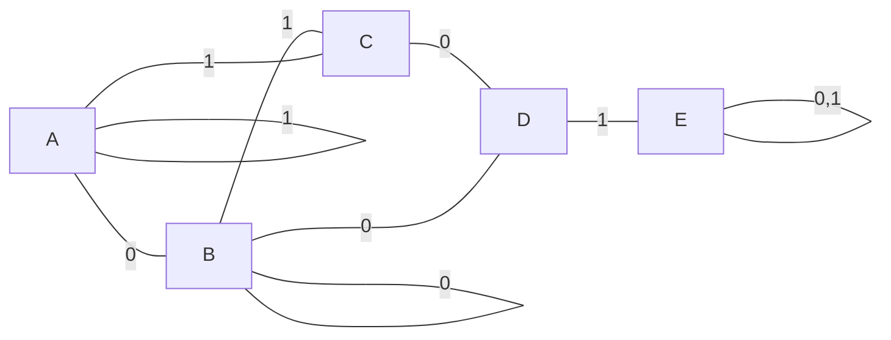
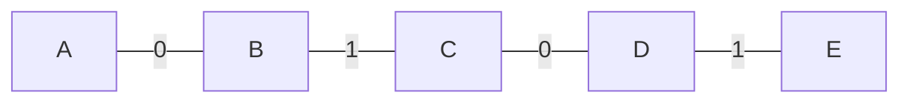

---
tags:
  - informatique
  - sorbonne
  - td
  - architecture-des-ordinateurs
Semestre: 3
---
4 états -> 2 bits
4 + 3 = 7 transitions
|> 0 -> 1, 1 -> 2, 2 -> 3, 3 -> 0, 1 -> 0, 2 -> 0, 0 -> 0

RST = reset

$F_1 = \overline{\text{RST}} . (c_1 \oplus c_2)$
$F_0 = \overline{\text{RST}} . \bar c_0$

5 états -> 3 bits
4 transitions

| États | $C_2$ | $C_1$ | $C_0$ |
| ----- | ----- | ----- | ----- |
| A     | 0     | 0     | 0     |
| B     | 0     | 0     | 1     |
| C     | 0     | 1     | 0     |
| D     | 0     | 1     | 1     |
| E     | 1     | 0     | 0     |

ext_A = ext_B = ext_C
WE_A = WE_B = WE_C
ext_D = 0

ADD = 0
1. `RA,RB,RC` -> ext_{A,B,C}+WE_{A,B,C}
2. `RD = RA+RB` -> OP_A+OP_B + ADD + WE_D
3. `RD = RD + RC`

5 états -> 3 bits
6 transitions

init = chargement dans les registres
s0 = comparaison
s1 = a < b -> a = a, b = b-a
s2 = a > b -> a = a-b, b = a
end = a == b -> met le résultat dans le registre

| États | Valeur |
| ----- | ------ |
| init  | 0      |
| $S_0$ | 1      |
| $S_1$ | 10     |
| $S_2$ | 11     |
| end   | 100    |

| $C_2$ | $C_1$ | $C_0$ | $a>b$ | $a=b$ | $F_2$ | $F_1$ | $F_0$ |
| ----- | ----- | ----- | ----- | ----- | ----- | ----- | ----- |
| 0     | 0     | 0     | 0     | 0     | 0     | 0     | 1     |
| 0     | 0     | 0     | 0     | 1     | 0     | 0     | 1     |
| 0     | 0     | 0     | 1     | 0     | 0     | 0     | 1     |
| 0     | 0     | 1     | 0     | 0     | 0     | 1     | 0     |
| 0     | 0     | 1     | 0     | 1     | 1     | 0     | 0     |
| 0     | 0     | 1     | 1     | 0     | 0     | 1     | 1     |
| 0     | 1     | 0     | 0     | 0     | 0     | 0     | 1     |
| 0     | 1     | 0     | 0     | 1     | 0     | 0     | 1     |
| 0     | 1     | 0     | 1     | 0     | 0     | 0     | 1     |
| 0     | 1     | 1     | 0     | 0     | 0     | 0     | 1     |
| 0     | 1     | 1     | 0     | 1     | 0     | 0     | 1     |
| 0     | 1     | 1     | 1     | 0     | 0     | 0     | 1     |
| 1     | 0     | 0     | 0     | 0     | 1     | 0     | 0     |
| 1     | 0     | 0     | 0     | 1     | 1     | 0     | 0     |
| 1     | 0     | 0     | 1     | 0     | 1     | 0     | 0     |
$F_0 = \overline{S_0.((a<b)+(a=b))+end}$
$F_1=S_0.(\overline{a=b})$
$F_2 = end+S_0.(a=b)$
