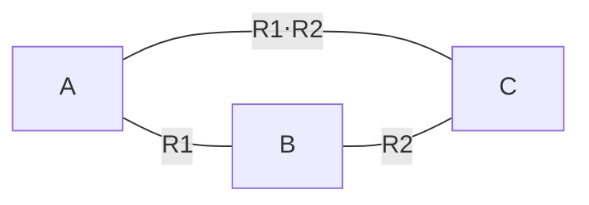

---
tags:
  - sorbonne
  - informatique
  - maths
semestre: 3
---
Partiel en novembre

On passe au TME après un certain temps

QCM obligatoire
|> commence le jour du cours et se finit le lundi en 8
|> peut le faire plusieurs fois -> c'est la dernière qui compte
|> il y en a 4

Note : 50% examen + 25% partiel + 10% projet + 10% interro TD  + 5% QCM
|> règle du max
## Ensembles
**Définition**
Ensemble est une réunion dans une même entité de certains objets déterminés. Un ensemble ne possède pas d'ordre

**Définition**
Relation d'appartenance est noté $\in$. Elle indique si un élément $e$ appartient à un ensemble $E$.

**Définition**
$\varnothing$ est l'ensemble vide, celui qui ne contient rien
$\{e\}$ est le singleton $e$ (i.e. l'ensemble contenant exclusivement $e$)

**Définition**
Le cardinal d'un ensemble est le nombre d'éléments appartenant à cet ensemble. On le note $|E|$ ou $\mathrm{card}(E)$.

Par exemple, on a :
$$|\{e\}| = 1$$
> [!warning] Ensemble dans un ensemble
> $2\not\in\{\{2\}\}$

**Proposition**
Tout ensemble contient l'ensemble vide.

**Définition**
La relation $A\subseteq B$ indique si $A$ est un sous-ensemble de $B$, i.e.
$$ \forall a\in A,\quad a\in B $$
**Proposition**
Cette relation est réflexive, i.e. $E\subseteq E$ est vraie

**Proposition**
Cette relation est transitive, i.e. $E_1\subseteq E_2\land E_2\subseteq E_3\quad\implies\quad E_1\subseteq E_3$ est vraie

**Définition**
On dit que $A=B$ si, et seulement si :
$$ A\subseteq B\quad\land\quad B\subseteq A $$

**Proposition**
Ainsi, on a que $\subseteq$ est anti-symétrique.

**Définition**
Une relation est d'ordre si elle est :
- réflexive
- transitive
- anti-symétrique

Elle est dite partielle si elle ne fonctionne par pour tous les éléments.

**Proposition**
Comme $\subseteq$ est réflexive, transitive et anti-symétrique, alors $\subseteq$ est une relation d'ordre.
Par contre, deux ensembles ne sont pas nécessairement comparables avec $\subseteq$ : il s'agit donc d'une relation d'ordre partielle.

**Définition**
$A\cup B$ est l'union de $A$ et $B$, deux sous-ensembles de $E$, tel que :
$$ A\cup B = \{x| x\in A\lor x\in B\} $$
$A\cap B$ est l'intersection tel que :
$$ A\cap B = \{x| x\in A\land x\in B\} $$
> [!info] Construction d'ensembles
> La construction des ensembles dans la dernière définition est dite par compréhension, comme en Python.

**Définition**
$A$ et $B$ sont disjoints si, et seulement si :
$$ A\cap B = \varnothing $$

**Théorème** - Formule du crible, formule de Poincaré
Soient $A$ et $B$ deux sous-ensemble de $E$. On a :
$$ |A\cup B| = |A|+|B|+|A\cap B| $$

**Définition**
La différence $A\backslash B$ , deux sous-ensembles de $E$, est :
$$ A\backslash B = \{x|x\in A\land x\notin B\} $$

**Définition**
Le complémentaire de $A$, un sous-ensemble de $E$, est noté $\bar A$ et est défini tel que :
$$ \bar A= E\backslash A $$

**Définition**
Le produit cartésien $A\times B$ est l'ensemble des couples $(a,b)$ avec $a\in A$ et $b\in B$. Donc :
$$ A\times B = \{(a,b)|a\in A,b\in B\} $$

**Proposition**
Si $E_1,\ldots,E_n$ sont des ensembles finis, alors $$\left|\prod^n_{i=1} E_i\right| = \prod^n_{i=1}|E_i|$$
Voir le diapo pour les propriétés classiques

**Définition**
Une partie $A$ d'un ensemble $E$ est un sous-ensemble de $E$.

$\mathcal{P}(E)$ est l'ensemble des parties de $E$.

> [!warning] $\mathcal{P}(E)$ ne peut jamais être vide !
> En effet, on a $\mathcal{P}(\varnothing) = \{\varnothing\} \neq \varnothing$ !
> Ne pas oublier que $\mathcal{P}(E)$ est un ensemble d'ensemble et que $\varnothing$ est bien un ensemble valide !

**Construction de $\mathcal{P}(E)$**
Si $E=\varnothing$, alors $\mathcal{P}(E) = \{\varnothing\}$
Sinon, $E=\{e\}\cup F\neq\varnothing$ ($e$ est un élément de $E$ et $F$ est ce qui reste, il peut être vide !)
Proposition : $$\mathcal{P}(\{e\}\cup F) = \mathcal{P}(F)\cup\{\{e\}\cup A|A\in\mathcal{P}(F)\}$$Ceci est un appel récursif de la fonction $\mathcal{P}$ permettant ainsi de construire l'ensemble des parties.

**Corollaire**
Si $E$ est un ensemble fini contenant $n$ éléments, alors $|\mathcal{P}(E)|=2^n$

**Définition**
Soit $E$ un ensemble.
Quand on partitionne $E$, on construit des parties non vides deux à deux disjointes.

Une partition de $E$ est une famille $(A_i)_{i\in I}$ de parties de $E$ telle que :
- $A_i\neq\varnothing$
- $A_i\cap A_j = \varnothing$ si $i\neq j$ (pour tout $(i,j)$ dans $I$)
- $E=\bigcup_{i\in I} A_i$

> [!warning] Une partition de $E$ n'est pas unique dans le cas générale !
## Relation
**Définition**
Relation binaire $R$ d'un ensemble $E$ vers $F$ est un sous-ensemble de $E\times F$, i.e.
$$ R\subseteq E\times F $$
On peut la noter $(x,y)\in R$, $x R y$, $R(x,y)$.
Lorsque $E=F$, on dit que $R$ est une relation binaire sur $E$.

Exemple :
- $\mathrm{Id}_E$ est la relation identité de $E$ est une relation binaire sur $E$ telle que $\{(e,e)|e\in E\}$
- $\mathrm{Id}_{\mathbb{N}} = \{(n,n)|n\in\mathbb{N}\}$
- $\leqslant$ sur $\mathbb{N}$ est aussi une relation binaire : $\{(n_1,n_2)\in\mathbb{N}^2|n_1\leqslant n_2\}$
- $<$ sur $\mathbb{N}$ est aussi une relation binaire (elle est incluse dans $\leqslant$)

> [!NOTE] Opérations sur les relations
> Comme une relation est un ensemble, on peut appliquer les opérations ensemblistes dessus 🎉

**Définition**
Relation $n$-aire est un sous-ensemble du produit cartésien $E_1\times\ldots\times E_n$

**Définition**
Une relation unaire est un sous-ensemble d'un ensemble $E$.

Définir par compréhension permet d'énoncer la propriété caractéristique de l'ensemble
|> on peut avoir une même relation pour des propriétés caractéristiques différentes
Définir par extension permet de lister les éléments

**Définition**
La relation inverse $R^{-1}$ d'une relation $R\subseteq E\times F$ est la relation de $F$ vers $E$ contenant tous les couples $(x,y)$ tels que $(y,x)\in R$, i.e.
$$ R^{-1} = \{(x,y)\in F\times E|(y,x)\in R\} $$

**Définition**
Un produit de relation est quand on applique plusieurs relations à la suite.

Le produit de $R_1\subseteq E\times F$ et de $R_2\subseteq F\times G$ est définie par :
$$ R_1R_2 = \left\{(x,y)\in E\times G\quad|\quad\exists z, (x,z)\in R_1\quad\land\quad(z,y)\in R_2\right\} $$ -> revoir le cours pour cette expression, ça me semble chelou
On la note $R_1\circ R_2$ ou $R_1\cdot R_2$.

Par exemple, on peut définir $<$ comme $S\cdot\leqslant$ où $S$ est la relation successeur (i.e. $S=\{(x,y)|x+1=y\}$)

> [!warning] Commutativité
> Le produit de relation n'est pas commutatif

> [!warning] $R\cdot R^{-1}\neq\mathrm{Id}_E$
> De même dans l'autre sens

**Propriétés**
$\varnothing$ est un élément est absorbant des relations : $R\cdot\varnothing = \varnothing\cdot R = R$
Le produit est associatif : $R_1\cdot(R_2\cdot R_3) = (R_1\cdot R_2)\cdot R_3$
$\mathrm{Id}$ est l'élément neutre : $R\cdot\mathrm{Id}_F = \mathrm{Id}_ER=R$ (si $R$ est dans $E\times F$)
|> ⚠ faire bien attention à la modification de l'identité en fonction qu'on soit à droite ou à gauche

**Notations**
Si $R$ est une relation sur $E$, on note :
$$ R^n = \underbrace{R\ldots R}_n = \left\{\begin{matrix}
	\mathrm{Id}_E&\text{si}&n=0\\
	R\cdot R^{n-1}&\text{sinon}
\end{matrix}\right. $$

***Revoir les diapos 23 à 29***

**Définition**
Une relation est dite d'équivalence si, et seulement si, elle est :
- réflexive
- symétrique
- transitive

Une relation est dite d'ordre si, et seulement si, elle est :
- réflexive
- anti-symétrique
- transitive

Par exemple :
- $\equiv$ (congruence) est une relation d'équivalence
- $\leqslant$ est une relation d'ordre
- $<$ n'est pas une relation d'ordre car elle n'est pas anti-symétrique !

**Définition**
Soit $R$ une relation d'équivalence sur $E$.
La classe d'équivalence d'un élément $e\in E$ pour $R$ est noté $[e]_R$ et :
$$ [e]_R = \{e'\in E|(e,e')\in R\} $$
Remarque : $e\in[e]_R$ car $R$ est réflexive

**Définition**
On note $E_{/R}$  l'ensemble des quotients de $E$ par $R$
***J'AI PAS EU LE TEMPS DE NOTER (diapo 31)***
## Fonctions
**Définition**
Une relation de $E$ vers $F$ est dite déterministe (ou fonctionnelle) si, et seulement si, tout élément de $E$ est en relation avec au plus un élément de $F$, i.e.
$$ \forall e\in E,\quad\forall(e_1,e_2)\in F^2,\quad(e,e_1)\in R\quad\land\quad(e,e_2)\in R \implies e_1=e_2 $$

Exemples :
- $S$ est fonctionnelle
- $S^{-1}$ l'est aussi
- $\leqslant$ ne l'est pas par contre

**Proposition**
Une relation déterministe est une fonction $f$.

Si $f$ n'est pas définie pour tout l'ensemble de départ, on dit qu'elle est partielle.

Preuves :
- relation déterministe ne donne qu'une unique image

**Définition**
Une relation $R$ de $E$ vers $F$ est dite totale à gauche si, et seulement si, chaque élément de $E$ est en relation avec au moins un élément de $F$ :
$$ \forall e_1\in E,\quad\exists e_2\in F,\quad (e_1,e_2)\in R $$

**Définition**
Une application est une relation déterministe et totale à gauche, on la note :
$$ f : E\to F $$
i.e. tout élément de $E$ possède une (unique) image.
On dit parfois qu'elle est une fonction totale.

***Voir diapo 36 à 45 car j'ai pas le temps de noter***