---
tags:
  - sorbonne
  - informatique
  - structure-des-données
semestre: 3
---
Les files de priorité servent à trouver le minimum/maximum d'un ensemble
|> clé/valeur avec la clé donnant le niveau de priorité
|> ajout doit être simple
|> recherche/extraction du min (resp. max) doit aussi être simple
## Implémentation naïve
Implémentation naïve en liste chaînée, son extraction est en $O(n)$ pour récupérer la valeur minimum
|> utilisation d'une liste chaînée triée permet d'éviter ça, mais on se retrouve à être en $O(n)$ pour l'insertion
-> on fait sûrement des opérations en trop car à chaque fois on trie tout
=> on peut utiliser un arbre pour que ça soit plus opti

Voir la définition de arbre $m$-aire en maths discrètes

On dit qu'un arbre est complet (ou « tassé à gauche ») si tous les niveaux sont remplis, sauf si le dernier est vide ou possède un nœud à gauche

```mermaid
flowchart TB
	A --> B
	A --> C
	B --> B1
	B --> B2
	C --> C1
	C --> C2["ø"]
```


Un tas (min) est un arbre binaire complet
|> tous les nœuds doivent avoir une valeur plus grande que celle de son père
-> le minimum se trouve en haut
-> le maximum on s'est pas où il est, on sait juste que c'est une feuille
|> la topologie de l'arbre est unique
|> sa hauteur est $\lfloor\log_2(n)\rfloor$ (on va le prouver en TD)

Propriétés des arbres complets (où $i$ est l'indice du nœud) :
- $i(\text{racine}) = 1$
- $i(\text{fils gauche}) = 2\times i(\text{père})$
- $i(\text{fils droit}) = 2\times i(\text{père})+1$
- $i(\text{père}) = \lfloor i(\text{fils gauche})\rfloor = i(\text{fils droit})$

On peut représenter l'arbre complet à l'aide d'un tableau
|> les indices de l'arbre sont aussi les indices du tableau 🎉
-> on peut stocker le nombre d'élément du tas dans la première case du tableau (car on commence à l'indice 1)

```c title="Fonction de transformations d'indice"
int indicePere(int i){
	return i/2;
}
int indiceFilsGauche(int i){
	return 2*i;
}
int indiceFilsDroit(int i){
	return 2*i+1;
}
```
Voir le diapo pour les tests d'existence

Pour ajouter un élément, on :
1. ajoute l'élément tout en bas (i.e. le plus au fond du tableau)
2. tant que l'élément est plus petit (resp. plus grand) que son père, on les échange
-> elle est en $O(\log_2 n)$ (car au pire on remonte à la racine)

Voir le diapo pour la fonction d'ajout implémenté

Pour extraire le plus petit (resp. max) élément, on :
1. remplace la racine par son plus grand (resp. plus petit) fils
2. tant que l'élément est plus grand (resp. plus petit) qu'un de ses fils, on les échange
-> elle est aussi en $O(\log n)$