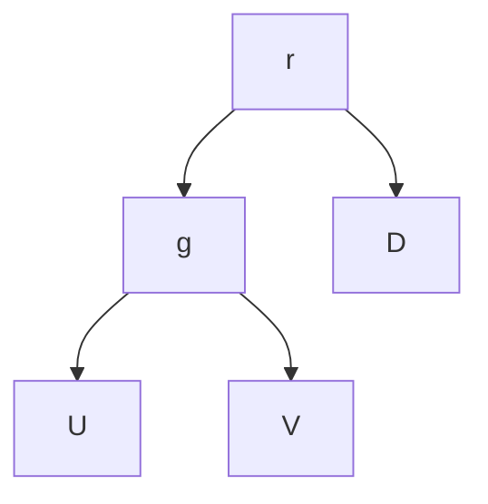
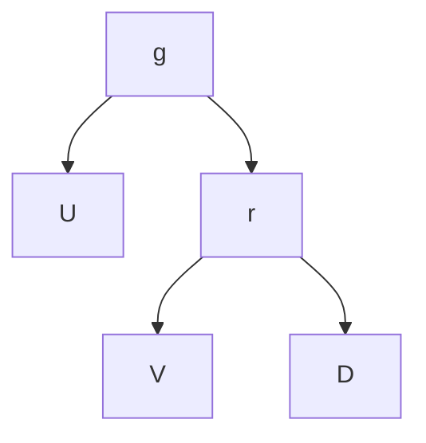

---
tags:
  - sorbonne
  - informatique
  - structure-des-données
semestre: 3
---
Propriété d'ordre dans un arbre permet d'améliorer la recherche de valeurs

Arbre binaire de recherche (ABR) permet de représenter un ensemble ordonné
|> chaque nœud a une valeur plus grande que celles contenues dans son sous-arbre gauche et plus petite que celles dans son sous-arbre droit

On note $h$ sa hauteur

Il s'agit de la même implémentation que pour les btree.

min et max sont plus simples
|> pour le min, on regarde à gauche -> $O(\log n)$
|> pour le max, on regarde à droite -> $O(\log n)$

**Voir diapo pour toutes les implémentations standards**

La vérification s'il s'agit d'un ABR est en $O(n)$

Très efficace si on a besoin d'avoir qlq chose de tout le temps trié
|> très efficace pour rechercher aussi (tjs en $O(h)$)

L'insertion se fait en $O(h)$ -> on recherche où il va

Quand on supprime, on doit remonter une valeur
|> soit on remonte son unique fils, soit on remonte le min de sous-arbre droit
|> pour supprimer un min, on le remplace juste par son unique fils (ou par rien)
-> toujours en $O(h)$

> [!warning] il n'existe pas de relation entre $n$ et $h$ !
## AVL (ABR équilibré)
Cette structure cherche à équilibrer l'ABR pour avoir une relation entre $n$ et $h$
|> besoin de gérer l'insertion et la suppression -> est compliqué de gérer ça

On a donc créer l'AVL qui est un ABR équilibré
|> propriété d'équilibre = la différence des hauteurs des fils gauche et droit de tout nœud ne peut excéder 1
|> on a donc $h=\log n$
-> tout devient en $\log n$ 🎉
|> besoin donc de gérer l'insertion et la suppression pour garder cette propriété

AVL a besoin d'un champ en plus par rapport au BTree -> la hauteur
|> permet d'éviter de recalculer la hauteur des nœuds (qui coûte $O(h)=O(\log n)$)

Lors de la création d'un nœud, on a besoin de calculer la hauteur

Insertion/suppression comme dans un ABR
|> par contre, si ça déséquilibre, on corrige
|> pour corriger, on utilise des rotations
-> on ne perd pas en complexité, tout reste en $O(h) = O(\log n)$


rotation vers la droite ->

(rotation vers la gauche est dans l'autre sens)

```c title="rotations"
AVL* rotDroite(AVL* racine) {
	AVL* r = racine;
	AVL* g = r->fg; // fils gauche
	AVL* v = g->fd; // fils droit
	g->fd = r;
	r->fg = v;
	majHauteur(r);
	majHauteur(g);
	return g;
}

AVL* rotGauche(AVL* racine) {
	AVL* g = racine;
	AVL* r = g->fg; // fils gauche
	AVL* v = r->fd; // fils droit
	g->fd = v;
	r->fg = r;
	majHauteur(r);
	majHauteur(g);
	return g;
}
```

**Insertion**
1. comme dans un ABR
2. tant que la diff de hauteur entre les fils gauche et droit ne dépassent pas 1, on continue de remonter
3. on note $A$ le premier ancêtre où cette différence dépasse 1
4. Si $h(G) - h(D) = 2$, alors
	1. si $h(G) < h(D)$, on fait une rotation à gauche de $G$
	2. on fait une rotation à droite de $A$
5. Si $h(G)-h(D)=-2$, alors
	1. si $h(D) < h(G)$, on fait une rotation à droite de $D$
	2. on fait une rotation à gauche de $A$
6. On a fini le traitement

Insertion est en $O(\log n)$

**Suppression**
1. comme dans un ABR
2. Si le nœud supprimé n'a pas été remplacé par un autre nœud, ou s’il a été remplacé par son unique fils, on examine ses ancêtres en remontant jusqu’à la racine
3. S’il a été remplacé par le max de son fils gauche (ou le min de son fils droit), alors on examine tous les ancêtres de ce dernier en remontant jusqu’à la racine.
4. Durant la remonté
	1. si la différence est inférieur ou égal à 1, on met à jour la hauteur
	2. si la différence est supérieure à 1, on applique les mêmes transformations que pour l'insertion

Suppression est en $O(\log n)$
## Tableau associatif
Les AVL peuvent être pertinent pour les tableaux associatifs

Hash est pertinent quand :
- l'ordre des clefs n'est pas pertinent
- on veut une performance constante
- fonction de hachage bien choisie

Parcourt trié est pertinent :
- l'ordre des clefs est important
- trouver le min, le max, le successeur, le prédécesseur...
- faire des recherches par intervalles de clés

AVL consomme moins de RAM et possède un meilleur pire cas