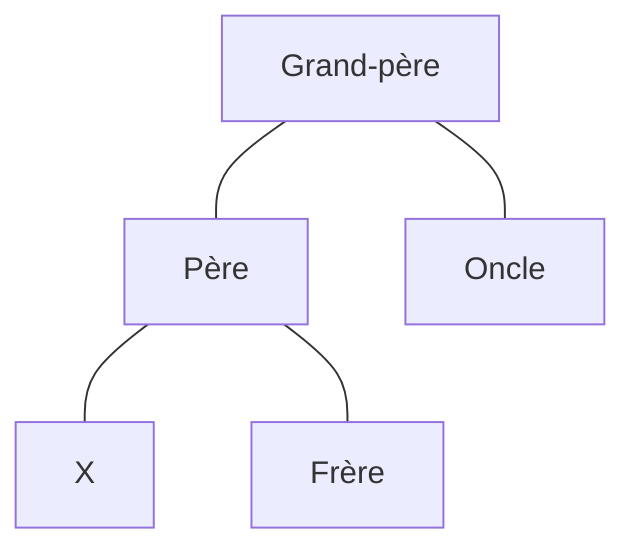

---
tags:
  - sorbonne
  - informatique
  - structure-des-données
semestre: 3
---
Problème de l'AVL
|> besoin de faire des rotations, ce qui transforme tout le graphe
|> concurrence impossible, change beaucoup en mémoire -> est très morcelé (donc défaut de page)
## Arbre rouge-noir
-> ici, on s'occupe de la fragmentation mémoire

Arbre rouge-noir
|> AVL demandant moins de rotations
|> racine est noire
|> fils d'un rouge est noir
|> si un nœud a moins de deux fils, on considère que les fictifs sont noirs
|> le nombre de nœuds noirs sur un chemin de la racine vers une feuille est toujours le même

Hauteur est toujours en $O(\log n)$ (on l'appelle *hauteur noire*)
-> les preuves sont sur le diapo

Problème de ces arbres
|> beaucoup de cas à gérer

**Insertion** -> le nœud est rouge
1. Si père est noir, on termine
2. Si c'est la racine, on le met en noir et on termine
3. Si père est rouge *et* oncle est rouge, alors
	- père devient noir
	- oncle devient noir
	- grand-père devient rouge
	- on fait un appel récursif sur grand-père
4. Dans tous les autres cas
	1. Si père est un fils gauche
		- seulement si c'est un fils droit, rotation gauche (X et père inversent leurs places)
		- père devient noir
		- grand-père devient noir
		- rotation droite de grand-père
	2. Si père est un fils droit
		- seulement si c'est un fils gauche, rotation droite (X et père inversent leurs places)
		- père devient noir
		- grand-père devient rouge
		- rotation gauche de grand-père

Est en $O(\log n)$

**Rattraper la suppression**
## Skip lists
-> ici, on s'occupe des la concurrence